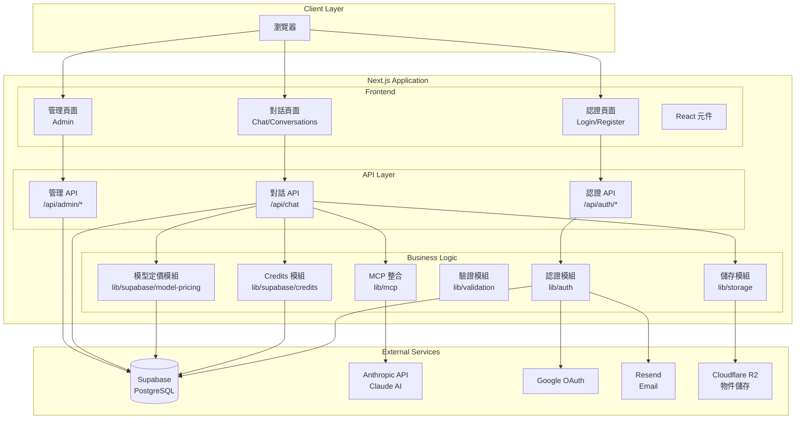
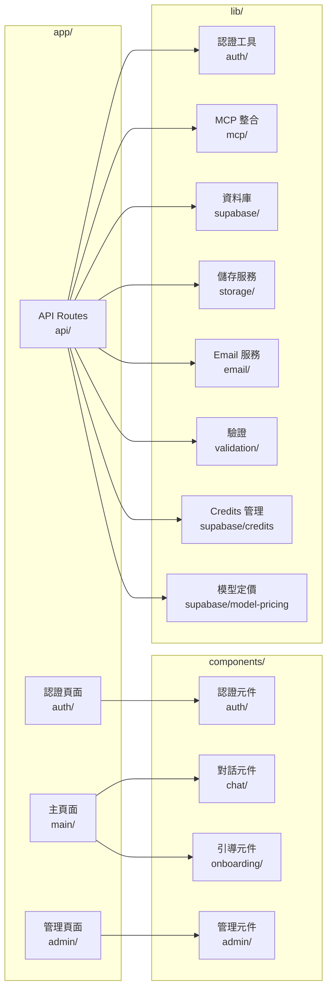
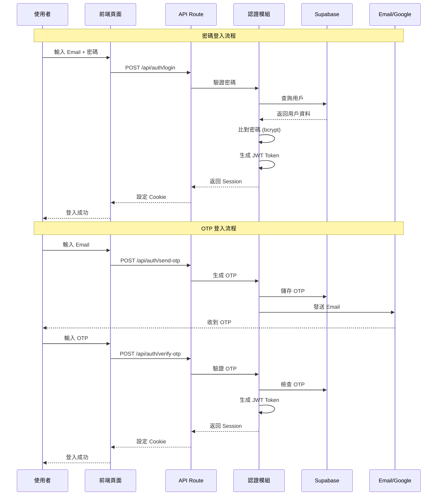
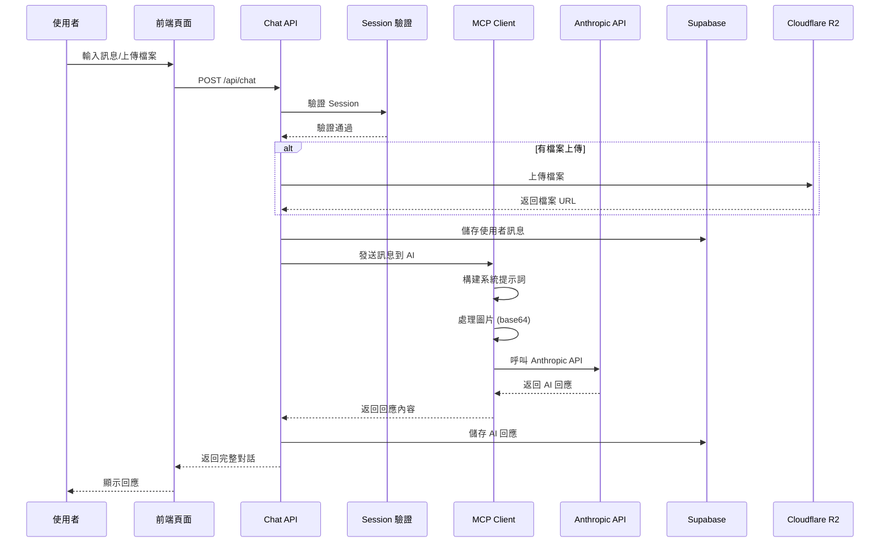
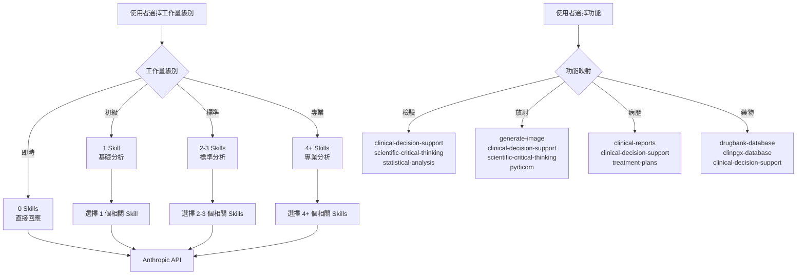
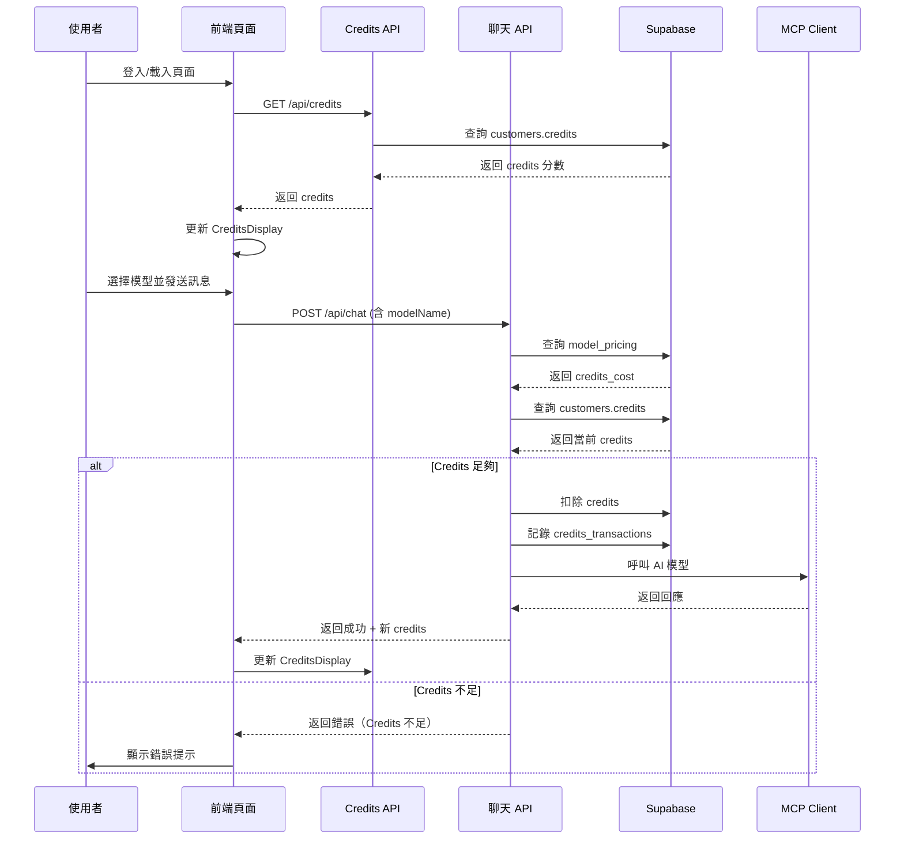
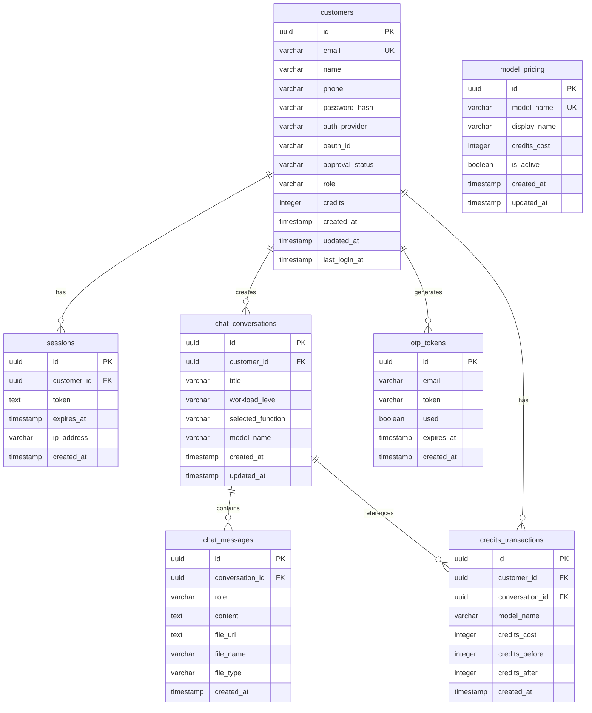
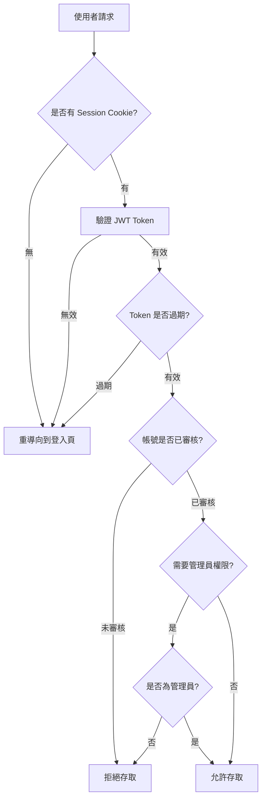
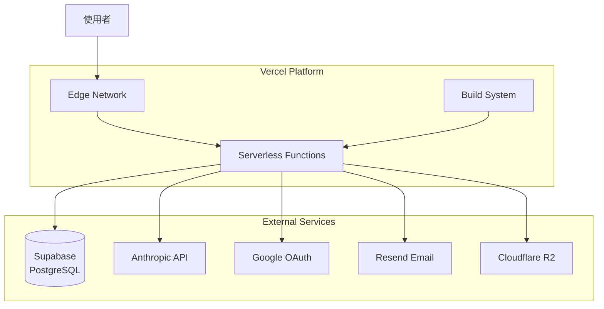

# 🏗️ 系統架構文件

> 最後更新：2026-01-29  
> 版本：v1.2.2

## 📋 目錄

1. [系統概覽](#系統概覽)
2. [技術棧](#技術棧)
3. [系統架構](#系統架構)
4. [資料流](#資料流)
5. [核心模組](#核心模組)
6. [資料庫設計](#資料庫設計)
7. [API 架構](#api-架構)
8. [安全性架構](#安全性架構)
9. [部署架構](#部署架構)
10. [Credits 系統與模型管理](#credits-系統與模型管理)

---

## 系統概覽

**Health Care Assistant** 是一個基於 Next.js 的智能臨床分析助手，提供檢驗報告、放射影像、病歷資料和藥物相關的 AI 分析功能。

### 核心功能

- ✅ **多種認證方式**：密碼、OTP、Google OAuth
- ✅ **智能對話系統**：支援文字、圖片、檔案上傳
- ✅ **AI 整合**：直接使用 Anthropic Claude API
- ✅ **工作量級別控制**：即時/初級/標準/專業
- ✅ **功能選擇**：檢驗/放射/病歷/藥物
- ✅ **對話歷史管理**：完整的對話記錄與查詢
- ✅ **管理員系統**：帳號審核與管理功能
- ✅ **Credits 系統**：點數管理、消費記錄、餘額查詢
- ✅ **多模型支援**：支援多種 AI 模型選擇與定價管理

---

## 技術棧

### 前端技術

| 技術 | 版本 | 用途 |
|------|------|------|
| **Next.js** | 14+ | React 框架，App Router |
| **TypeScript** | 5+ | 類型安全 |
| **Tailwind CSS** | 3.4+ | 樣式框架 |
| **React** | 18+ | UI 框架 |

### 後端技術

| 技術 | 版本 | 用途 |
|------|------|------|
| **Next.js API Routes** | 14+ | 後端 API |
| **Supabase** | 2.90+ | PostgreSQL 資料庫 |
| **JWT (jose)** | 6.1+ | Session 管理 |
| **bcryptjs** | 3.0+ | 密碼加密 |

### 第三方服務

| 服務 | 用途 |
|------|------|
| **Anthropic Claude API** | AI 對話引擎 |
| **Google OAuth 2.0** | 第三方登入 |
| **Resend** | Email 服務（OTP 發送） |
| **Cloudflare R2** | 物件儲存（檔案上傳） |

### 開發工具

| 工具 | 用途 |
|------|------|
| **Zod** | 資料驗證 |
| **ESLint** | 程式碼檢查 |
| **TypeScript** | 類型檢查 |
| **Vitest** | 單元測試與整合測試 |
| **@testing-library/react** | React 元件測試 |

---

## 系統架構

### 高層架構圖



### 模組架構



---

## 資料流

### 認證流程



### 對話流程



### 工作量級別與 Skills 映射



### Credits 扣除流程



---

## 核心模組

### 1. 認證模組 (`lib/auth/`)

| 檔案 | 功能 |
|------|------|
| `session.ts` | JWT Session 管理（生成、驗證、刷新） |
| `password.ts` | 密碼加密與驗證（bcrypt） |
| `otp-generator.ts` | OTP 生成與驗證 |
| `google-oauth.ts` | Google OAuth 驗證 |
| `admin.ts` | 管理員權限檢查 |

**設計決策**：
- 使用 JWT 而非 Session Cookie，便於無狀態擴展
- Session 有效期 7 天，平衡安全性與使用者體驗
- OTP 有效期 10 分鐘，降低安全風險

### 2. MCP 整合模組 (`lib/mcp/`)

| 檔案 | 功能 |
|------|------|
| `client.ts` | MCP Client 實作（直接使用 Anthropic API，支援 modelName 參數） |
| `workload.ts` | 工作量級別配置與 Skills 數量計算 |
| `function-mapping.ts` | 功能類型到 Skills 的映射 |
| `types.ts` | MCP 相關類型定義 |

**設計決策**：
- **直接使用 Anthropic API**：不依賴 MCP Server，提高可靠性
- **工作量級別控制**：根據使用者選擇動態調整 Skills 數量
- **功能映射**：將使用者選擇的功能映射到相關的 AI Skills
- **圖片處理**：自動將上傳的圖片轉換為 base64 格式傳遞給 AI
- **多模型支援**：根據 `modelName` 參數選擇對應的 Anthropic 模型（如 claude-sonnet-4-20250514、claude-3-haiku-20240307）

### 3. 資料庫模組 (`lib/supabase/`)

| 檔案 | 功能 |
|------|------|
| `client.ts` | Supabase 客戶端初始化 |
| `customers.ts` | 客戶 CRUD 操作 |
| `otp.ts` | OTP Token 管理 |
| `conversations.ts` | 對話記錄管理 |
| `messages.ts` | 訊息管理 |
| `credits.ts` | Credits 管理（查詢、扣除、增加、歷史記錄） |
| `model-pricing.ts` | 模型定價管理（查詢、建立、更新） |

**設計決策**：
- 使用 Supabase 作為 PostgreSQL 的託管服務
- 所有資料庫操作都通過 TypeScript 函數封裝
- 使用索引優化查詢效能
- Credits 扣除採用原子性操作，確保資料一致性
- 所有 Credits 交易都記錄在 `credits_transactions` 表中，便於審計

### 4. 儲存模組 (`lib/storage/`)

| 檔案 | 功能 |
|------|------|
| `upload.ts` | 檔案上傳到 Cloudflare R2 |

**設計決策**：
- 從 Supabase Storage 遷移到 Cloudflare R2，提升效能與成本效益
- 支援自訂公開網域
- 檔案大小限制 10MB
- 支援格式：JPEG、PDF、DOCX、TXT

### 5. 驗證模組 (`lib/validation/`)

| 檔案 | 功能 |
|------|------|
| `schemas.ts` | Zod 驗證 Schema |

**設計決策**：
- 使用 Zod 進行運行時驗證
- 所有 API 輸入都經過驗證
- 提供清晰的錯誤訊息

---

## 資料庫設計

### ER 圖



### 資料表說明

#### `customers` - 客戶表

| 欄位 | 類型 | 說明 |
|------|------|------|
| `id` | UUID | 主鍵 |
| `email` | VARCHAR(255) | Email（唯一） |
| `name` | VARCHAR(255) | 姓名 |
| `phone` | VARCHAR(50) | 電話（可選） |
| `password_hash` | VARCHAR(255) | 密碼雜湊（可選） |
| `auth_provider` | VARCHAR(20) | 認證提供者：password/otp/google |
| `oauth_id` | VARCHAR(255) | OAuth 提供者的用戶 ID |
| `approval_status` | VARCHAR(20) | 審核狀態：pending/approved/rejected |
| `role` | VARCHAR(20) | 角色：user/admin |
| `credits` | INTEGER | Credits 分數（預設 0） |
| `created_at` | TIMESTAMP | 建立時間 |
| `updated_at` | TIMESTAMP | 更新時間 |
| `last_login_at` | TIMESTAMP | 最後登入時間 |

**索引**：
- `idx_customers_email` - Email 查詢優化
- `idx_customers_oauth_id` - OAuth ID 查詢優化
- `idx_customers_approval_status` - 審核狀態查詢優化
- `idx_customers_role` - 角色查詢優化

#### `sessions` - Session 表

| 欄位 | 類型 | 說明 |
|------|------|------|
| `id` | UUID | 主鍵 |
| `customer_id` | UUID | 客戶 ID（外鍵） |
| `token` | TEXT | JWT Token |
| `expires_at` | TIMESTAMP | 過期時間 |
| `ip_address` | VARCHAR(45) | IP 地址 |
| `created_at` | TIMESTAMP | 建立時間 |

**索引**：
- `idx_sessions_customer_id` - 客戶查詢優化
- `idx_sessions_token` - Token 查詢優化

#### `chat_conversations` - 對話表

| 欄位 | 類型 | 說明 |
|------|------|------|
| `id` | UUID | 主鍵 |
| `customer_id` | UUID | 客戶 ID（外鍵） |
| `title` | VARCHAR(255) | 對話標題 |
| `workload_level` | VARCHAR(20) | 工作量級別：instant/basic/standard/professional |
| `selected_function` | VARCHAR(50) | 選擇的功能：lab/radiology/medical_record/medication |
| `model_name` | VARCHAR(255) | 使用的 AI 模型名稱 |
| `created_at` | TIMESTAMP | 建立時間 |
| `updated_at` | TIMESTAMP | 更新時間 |

**索引**：
- `idx_chat_conversations_customer_id` - 客戶查詢優化

#### `chat_messages` - 訊息表

| 欄位 | 類型 | 說明 |
|------|------|------|
| `id` | UUID | 主鍵 |
| `conversation_id` | UUID | 對話 ID（外鍵） |
| `role` | VARCHAR(20) | 角色：user/assistant |
| `content` | TEXT | 訊息內容 |
| `file_url` | TEXT | 檔案 URL（可選） |
| `file_name` | VARCHAR(255) | 檔案名稱（可選） |
| `file_type` | VARCHAR(50) | 檔案類型（可選） |
| `created_at` | TIMESTAMP | 建立時間 |

**索引**：
- `idx_chat_messages_conversation_id` - 對話查詢優化

#### `model_pricing` - 模型定價表

| 欄位 | 類型 | 說明 |
|------|------|------|
| `id` | UUID | 主鍵 |
| `model_name` | VARCHAR(255) | 模型名稱（唯一，如 claude-sonnet-4-20250514） |
| `display_name` | VARCHAR(255) | 顯示名稱 |
| `credits_cost` | INTEGER | 每次使用消耗的點數 |
| `is_active` | BOOLEAN | 是否啟用（預設 true） |
| `created_at` | TIMESTAMP | 建立時間 |
| `updated_at` | TIMESTAMP | 更新時間 |

**索引**：
- `idx_model_pricing_model_name` - 模型名稱查詢優化
- `idx_model_pricing_is_active` - 啟用狀態查詢優化

#### `credits_transactions` - Credits 交易記錄表

| 欄位 | 類型 | 說明 |
|------|------|------|
| `id` | UUID | 主鍵 |
| `customer_id` | UUID | 客戶 ID（外鍵） |
| `conversation_id` | UUID | 對話 ID（外鍵，可選） |
| `model_name` | VARCHAR(255) | 使用的模型名稱 |
| `credits_cost` | INTEGER | 消耗的點數 |
| `credits_before` | INTEGER | 消費前餘額 |
| `credits_after` | INTEGER | 消費後餘額 |
| `created_at` | TIMESTAMP | 建立時間 |

**索引**：
- `idx_credits_transactions_customer_id` - 客戶查詢優化
- `idx_credits_transactions_conversation_id` - 對話查詢優化
- `idx_credits_transactions_created_at` - 時間查詢優化

#### 實時同步與快取政策

為了確保後台管理員更新模型狀態或定價時，前台使用者能即時看到變動，系統實施了以下政策：

1. **API 動態路由**：`/api/models` 與 `/api/admin/models` 使用 `export const dynamic = 'force-dynamic'`，停用 Next.js 的靜態優化與快取。
2. **前端不快取請求**：前端 Fetch 請求使用 `{ cache: 'no-store' }`，確保瀏覽器不讀取舊資料。
3. **Supabase Realtime**：使用 Supabase Realtime 訂閱 `model_pricing` 表的變動。
4. **RLS 政策考量**：
   - 為了讓 Realtime 能正常工作，即便模型已停用，RLS 政策也需允許認證使用者讀取該筆資料（`is_active = false` 的資料對 Realtime 而言必須是「可見」的，否則客戶端收不到變動通知）。
   - 過濾邏輯由應用程式層級（API）負責。

---

## API 架構

### API 端點總覽

#### 認證 API (`/api/auth/*`)

| 方法 | 路徑 | 功能 | 認證 |
|------|------|------|------|
| POST | `/api/auth/register` | 註冊（密碼/OTP） | ❌ |
| POST | `/api/auth/login` | 登入（密碼/OTP） | ❌ |
| POST | `/api/auth/send-otp` | 發送 OTP | ❌ |
| POST | `/api/auth/verify-otp` | 驗證 OTP | ❌ |
| POST | `/api/auth/google` | Google OAuth | ❌ |
| POST | `/api/auth/logout` | 登出 | ✅ |
| GET | `/api/auth/me` | 獲取當前用戶 | ✅ |
| GET | `/api/auth/admin-check` | 檢查管理員權限 | ✅ |

#### 對話 API

| 方法 | 路徑 | 功能 | 認證 |
|------|------|------|------|
| POST | `/api/chat` | 發送訊息並取得 AI 回應（支援 modelName，自動扣除 Credits） | ✅ |
| GET | `/api/chat` | 獲取對話訊息 | ✅ |
| GET | `/api/conversations` | 獲取對話列表 | ✅ |

#### Credits API

| 方法 | 路徑 | 功能 | 認證 |
|------|------|------|------|
| GET | `/api/credits` | 取得當前用戶的 Credits 分數 | ✅ |
| GET | `/api/credits/history` | 取得消費歷史記錄 | ✅ |
| GET | `/api/models` | 取得所有啟用的模型列表 | ✅ |

#### 管理 API (`/api/admin/*`)

| 方法 | 路徑 | 功能 | 認證 |
|------|------|------|------|
| GET | `/api/admin/customers` | 獲取客戶列表 | ✅ Admin |
| POST | `/api/admin/approve` | 審核通過 | ✅ Admin |
| POST | `/api/admin/reject` | 審核拒絕 | ✅ Admin |
| GET | `/api/admin/models` | 取得所有模型列表（含停用） | ✅ Admin |
| POST | `/api/admin/models` | 建立新模型 | ✅ Admin |
| PUT | `/api/admin/models/:modelName` | 更新模型定價 | ✅ Admin |
| DELETE | `/api/admin/models/:modelName` | 停用模型 | ✅ Admin |
| POST | `/api/admin/credits/add` | 為用戶增加 Credits | ✅ Admin |

### API 回應格式

#### 成功回應

```typescript
{
  success: true,
  data: {
    // 回應資料
  }
}
```

#### 錯誤回應

```typescript
{
  success: false,
  error: "錯誤訊息"
}
```

### Rate Limiting

所有認證相關 API 都實施 Rate Limiting：
- **記憶體儲存**：開發環境使用記憶體，生產環境建議使用 Redis
- **限制規則**：
  - 登入/註冊：每 IP 每 15 分鐘 5 次
  - OTP 發送：每 Email 每 15 分鐘 3 次
  - OTP 驗證：每 Email 每 15 分鐘 10 次

---

## 安全性架構

### 認證與授權



### 安全措施

1. **密碼加密**：使用 bcrypt（salt rounds: 10）
2. **JWT Token**：使用 HS256 演算法，有效期 7 天
3. **Session 管理**：Token 儲存在 HttpOnly Cookie 中
4. **Rate Limiting**：防止暴力破解攻擊
5. **輸入驗證**：所有 API 輸入都經過 Zod 驗證
6. **SQL 注入防護**：使用 Supabase 參數化查詢
7. **XSS 防護**：React 自動轉義
8. **CSRF 防護**：SameSite Cookie 設定

---

## 部署架構

### Vercel 部署架構



### 環境變數管理

- **開發環境**：`.env.local`（不提交到 Git）
- **生產環境**：Vercel Dashboard → Environment Variables
- **安全性檢查**：`npm run check:env` 腳本驗證

### 部署流程

1. **代碼提交**：推送到 GitHub
2. **自動觸發**：Vercel 偵測到推送
3. **建置**：執行 `npm run build`
4. **部署**：部署到 Edge Network
5. **驗證**：檢查環境變數與功能

---

## 效能優化

### 前端優化

- ✅ **Next.js App Router**：自動程式碼分割
- ✅ **Tailwind CSS**：僅載入使用的樣式
- ✅ **圖片優化**：Next.js Image 元件（未來可擴展）

### 後端優化

- ✅ **資料庫索引**：所有查詢欄位都有索引
- ✅ **連線池**：Supabase 自動管理
- ✅ **快取策略**：Session 驗證結果可快取（未來可擴展）

### 已知限制與未來優化

1. **Rate Limiting**：目前使用記憶體，建議遷移到 Redis
2. **SSE 串流**：目前是完整回應，未來可實作真正的串流
3. **圖片處理**：大圖片會增加 API 請求大小，建議限制圖片尺寸
4. **快取機制**：API 已針對模型資料實施 `force-dynamic`，確保即時性。

---

## 擴展性考量

### 水平擴展

- ✅ **無狀態設計**：所有 API 都是無狀態的
- ✅ **Serverless**：Vercel Functions 自動擴展
- ✅ **資料庫**：Supabase 自動擴展

### 垂直擴展

- ✅ **資料庫優化**：索引與查詢優化
- ✅ **API 優化**：減少不必要的資料庫查詢

---

## 監控與日誌

### 日誌記錄

- **開發環境**：Console 日誌
- **生產環境**：Vercel Functions 日誌

### 監控項目

- API 回應時間
- 錯誤率
- 資料庫查詢效能
- 檔案上傳成功率

---

## 參考文件

- [README.md](./README.md) - 專案說明
- [SPECIFICATIONS.md](./SPECIFICATIONS.md) - 系統規格
- [DEPLOYMENT_GUIDE.md](./DEPLOYMENT_GUIDE.md) - 部署指南
- [ENV_VARIABLES.md](./ENV_VARIABLES.md) - 環境變數說明

---

---

## Credits 系統與模型管理

### 系統概述

Credits 系統提供點數管理機制，用於控制 AI 模型的使用成本。系統支援多種 AI 模型，每個模型有不同的定價，使用者在使用前需要確保有足夠的 Credits。

### 核心功能

1. **Credits 管理**
   - 查詢當前餘額
   - 扣除 Credits（使用 AI 模型時）
   - 增加 Credits（管理員操作）
   - 交易歷史記錄

2. **模型定價管理**
   - 支援多種 AI 模型
   - 每個模型有獨立的定價
   - 管理員可動態調整定價
   - 模型啟用/停用控制

3. **前端整合**
   - Credits 顯示元件（`CreditsDisplay.tsx`）
   - 模型選擇器元件（`ModelSelector.tsx`）
   - 自動檢查 Credits 餘額
   - 不足時顯示錯誤提示

### 資料流程

1. **登入時查詢 Credits**：使用者登入後，系統自動查詢並返回 Credits 分數
2. **使用前檢查**：發送訊息前檢查 Credits 是否足夠
3. **扣除與記錄**：使用成功後扣除 Credits 並記錄交易
4. **即時更新**：前端即時更新 Credits 顯示

### 預設模型定價

| 模型名稱 | 顯示名稱 | Credits 消耗 |
|---------|---------|-------------|
| `claude-sonnet-4-20250514` | Claude Sonnet 4 | 10 點 |
| `claude-3-haiku-20240307` | Claude 3 Haiku | 5 點 |

### 測試策略

系統採用 **TDD（Test-Driven Development）** 開發模式：

- **單元測試**：使用 Vitest 測試所有後端函數
- **整合測試**：測試完整流程（選擇模型 → 發送 → 扣除 Credits）
- **元件測試**：使用 @testing-library/react 測試前端元件
- **測試覆蓋率目標**：關鍵邏輯 100%，整體 ≥ 90%

詳細測試計劃請參考 `credits_系統與模型管理.plan.md`。

---

**文件維護者**：開發團隊  
**最後審查日期**：2026-01-29
