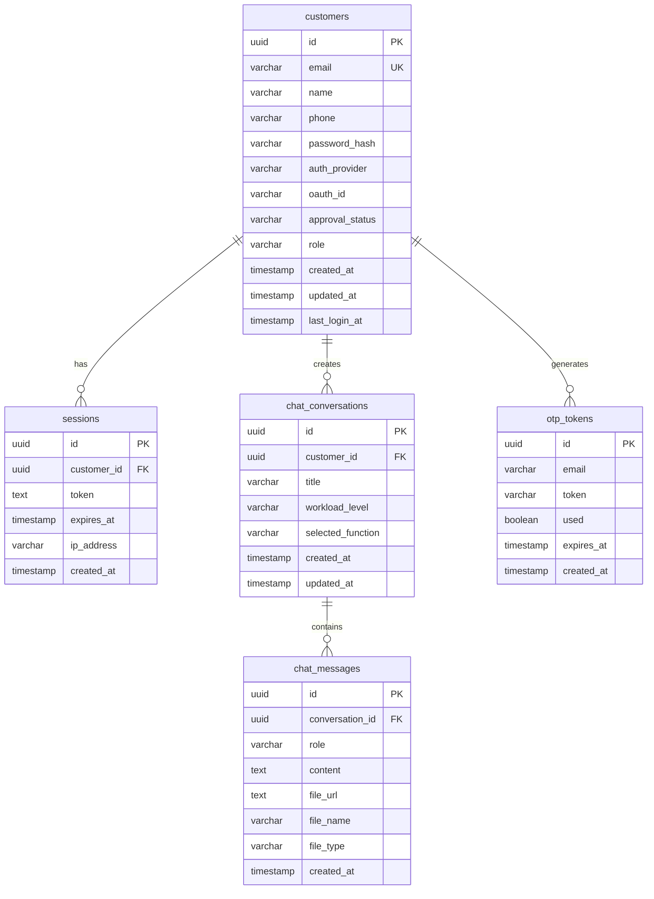

# 🏗️ 系統架構文件

> 最後更新：2026-01-19  
> 版本：v1.1.0

## 📋 目錄

1. [系統概覽](#系統概覽)
2. [技術棧](#技術棧)
3. [系統架構](#系統架構)
4. [資料流](#資料流)
5. [核心模組](#核心模組)
6. [資料庫設計](#資料庫設計)
7. [API 架構](#api-架構)
8. [安全性架構](#安全性架構)
9. [部署架構](#部署架構)

---

## 系統概覽

**Health Care Assistant** 是一個基於 Next.js 的智能臨床分析助手，提供檢驗報告、放射影像、病歷資料和藥物相關的 AI 分析功能。

### 核心功能

- ✅ **多種認證方式**：密碼、OTP、Google OAuth
- ✅ **智能對話系統**：支援文字、圖片、檔案上傳
- ✅ **AI 整合**：直接使用 Anthropic Claude API
- ✅ **工作量級別控制**：即時/初級/標準/專業
- ✅ **功能選擇**：檢驗/放射/病歷/藥物
- ✅ **對話歷史管理**：完整的對話記錄與查詢
- ✅ **管理員系統**：帳號審核與管理功能

---

## 技術棧

### 前端技術

| 技術 | 版本 | 用途 |
|------|------|------|
| **Next.js** | 14+ | React 框架，App Router |
| **TypeScript** | 5+ | 類型安全 |
| **Tailwind CSS** | 3.4+ | 樣式框架 |
| **React** | 18+ | UI 框架 |

### 後端技術

| 技術 | 版本 | 用途 |
|------|------|------|
| **Next.js API Routes** | 14+ | 後端 API |
| **Supabase** | 2.90+ | PostgreSQL 資料庫 |
| **JWT (jose)** | 6.1+ | Session 管理 |
| **bcryptjs** | 3.0+ | 密碼加密 |

### 第三方服務

| 服務 | 用途 |
|------|------|
| **Anthropic Claude API** | AI 對話引擎 |
| **Google OAuth 2.0** | 第三方登入 |
| **Resend** | Email 服務（OTP 發送） |
| **Cloudflare R2** | 物件儲存（檔案上傳） |

### 開發工具

| 工具 | 用途 |
|------|------|
| **Zod** | 資料驗證 |
| **ESLint** | 程式碼檢查 |
| **TypeScript** | 類型檢查 |

---

## 系統架構

### 高層架構圖

```mermaid
flowchart TB
    subgraph "Client Layer"
        Browser[瀏覽器]
    end
    
    subgraph "Next.js Application"
        subgraph "Frontend"
            AuthPages[認證頁面<br/>Login/Register]
            ChatPages[對話頁面<br/>Chat/Conversations]
            AdminPages[管理頁面<br/>Admin]
            Components[React 元件]
        end
        
        subgraph "API Layer"
            AuthAPI[認證 API<br/>/api/auth/*]
            ChatAPI[對話 API<br/>/api/chat]
            AdminAPI[管理 API<br/>/api/admin/*]
        end
        
        subgraph "Business Logic"
            AuthLib[認證模組<br/>lib/auth]
            MCPLib[MCP 整合<br/>lib/mcp]
            StorageLib[儲存模組<br/>lib/storage]
            ValidationLib[驗證模組<br/>lib/validation]
        end
    end
    
    subgraph "External Services"
        Supabase[(Supabase<br/>PostgreSQL)]
        Anthropic[Anthropic API<br/>Claude AI]
        Google[Google OAuth]
        Resend[Resend<br/>Email]
        R2[Cloudflare R2<br/>物件儲存]
    end
    
    Browser --> AuthPages
    Browser --> ChatPages
    Browser --> AdminPages
    
    AuthPages --> AuthAPI
    ChatPages --> ChatAPI
    AdminPages --> AdminAPI
    
    AuthAPI --> AuthLib
    ChatAPI --> MCPLib
    ChatAPI --> StorageLib
    
    AuthLib --> Supabase
    AuthLib --> Google
    AuthLib --> Resend
    
    MCPLib --> Anthropic
    StorageLib --> R2
    
    ChatAPI --> Supabase
    AdminAPI --> Supabase
```



### 模組架構

```mermaid
graph LR
    subgraph "app/"
        A1[認證頁面<br/>auth/]
        A2[主頁面<br/>main/]
        A3[管理頁面<br/>admin/]
        A4[API Routes<br/>api/]
    end
    
    subgraph "components/"
        C1[認證元件<br/>auth/]
        C2[對話元件<br/>chat/]
        C3[引導元件<br/>onboarding/]
        C4[管理元件<br/>admin/]
    end
    
    subgraph "lib/"
        L1[認證工具<br/>auth/]
        L2[MCP 整合<br/>mcp/]
        L3[資料庫<br/>supabase/]
        L4[儲存服務<br/>storage/]
        L5[Email 服務<br/>email/]
        L6[驗證<br/>validation/]
    end
    
    A1 --> C1
    A2 --> C2
    A2 --> C3
    A3 --> C4
    
    A4 --> L1
    A4 --> L2
    A4 --> L3
    A4 --> L4
    A4 --> L5
    A4 --> L6
```



---

## 資料流

### 認證流程

```mermaid
sequenceDiagram
    participant U as 使用者
    participant F as 前端頁面
    participant A as API Route
    participant L as 認證模組
    participant D as Supabase
    participant E as Email/Google
    
    Note over U,E: 密碼登入流程
    U->>F: 輸入 Email + 密碼
    F->>A: POST /api/auth/login
    A->>L: 驗證密碼
    L->>D: 查詢用戶
    D-->>L: 返回用戶資料
    L->>L: 比對密碼 (bcrypt)
    L->>L: 生成 JWT Token
    L-->>A: 返回 Session
    A-->>F: 設定 Cookie
    F-->>U: 登入成功
    
    Note over U,E: OTP 登入流程
    U->>F: 輸入 Email
    F->>A: POST /api/auth/send-otp
    A->>L: 生成 OTP
    L->>D: 儲存 OTP
    L->>E: 發送 Email
    E-->>U: 收到 OTP
    U->>F: 輸入 OTP
    F->>A: POST /api/auth/verify-otp
    A->>L: 驗證 OTP
    L->>D: 檢查 OTP
    L->>L: 生成 JWT Token
    L-->>A: 返回 Session
    A-->>F: 設定 Cookie
    F-->>U: 登入成功
```



### 對話流程

```mermaid
sequenceDiagram
    participant U as 使用者
    participant F as 前端頁面
    participant A as Chat API
    participant S as Session 驗證
    participant M as MCP Client
    participant AI as Anthropic API
    participant D as Supabase
    participant R2 as Cloudflare R2
    
    U->>F: 輸入訊息/上傳檔案
    F->>A: POST /api/chat
    A->>S: 驗證 Session
    S-->>A: 驗證通過
    
    alt 有檔案上傳
        A->>R2: 上傳檔案
        R2-->>A: 返回檔案 URL
    end
    
    A->>D: 儲存使用者訊息
    A->>M: 發送訊息到 AI
    M->>M: 構建系統提示詞
    M->>M: 處理圖片 (base64)
    M->>AI: 呼叫 Anthropic API
    AI-->>M: 返回 AI 回應
    M-->>A: 返回回應內容
    A->>D: 儲存 AI 回應
    A-->>F: 返回完整對話
    F-->>U: 顯示回應
```



### 工作量級別與 Skills 映射

```mermaid
flowchart TD
    Start[使用者選擇工作量級別] --> Check{工作量級別}
    
    Check -->|即時| Instant[0 Skills<br/>直接回應]
    Check -->|初級| Basic[1 Skill<br/>基礎分析]
    Check -->|標準| Standard[2-3 Skills<br/>標準分析]
    Check -->|專業| Professional[4+ Skills<br/>專業分析]
    
    Start2[使用者選擇功能] --> Map{功能映射}
    Map -->|檢驗| Lab[clinical-decision-support<br/>scientific-critical-thinking<br/>statistical-analysis]
    Map -->|放射| Radio[generate-image<br/>clinical-decision-support<br/>scientific-critical-thinking<br/>pydicom]
    Map -->|病歷| Record[clinical-reports<br/>clinical-decision-support<br/>treatment-plans]
    Map -->|藥物| Med[drugbank-database<br/>clinpgx-database<br/>clinical-decision-support]
    
    Instant --> AI[Anthropic API]
    Basic --> Select1[選擇 1 個相關 Skill]
    Standard --> Select3[選擇 2-3 個相關 Skills]
    Professional --> Select5[選擇 4+ 個相關 Skills]
    
    Select1 --> AI
    Select3 --> AI
    Select5 --> AI
```



---

## 核心模組

### 1. 認證模組 (`lib/auth/`)

| 檔案 | 功能 |
|------|------|
| `session.ts` | JWT Session 管理（生成、驗證、刷新） |
| `password.ts` | 密碼加密與驗證（bcrypt） |
| `otp-generator.ts` | OTP 生成與驗證 |
| `google-oauth.ts` | Google OAuth 驗證 |
| `admin.ts` | 管理員權限檢查 |

**設計決策**：
- 使用 JWT 而非 Session Cookie，便於無狀態擴展
- Session 有效期 7 天，平衡安全性與使用者體驗
- OTP 有效期 10 分鐘，降低安全風險

### 2. MCP 整合模組 (`lib/mcp/`)

| 檔案 | 功能 |
|------|------|
| `client.ts` | MCP Client 實作（直接使用 Anthropic API） |
| `workload.ts` | 工作量級別配置與 Skills 數量計算 |
| `function-mapping.ts` | 功能類型到 Skills 的映射 |
| `types.ts` | MCP 相關類型定義 |

**設計決策**：
- **直接使用 Anthropic API**：不依賴 MCP Server，提高可靠性
- **工作量級別控制**：根據使用者選擇動態調整 Skills 數量
- **功能映射**：將使用者選擇的功能映射到相關的 AI Skills
- **圖片處理**：自動將上傳的圖片轉換為 base64 格式傳遞給 AI

### 3. 資料庫模組 (`lib/supabase/`)

| 檔案 | 功能 |
|------|------|
| `client.ts` | Supabase 客戶端初始化 |
| `customers.ts` | 客戶 CRUD 操作 |
| `otp.ts` | OTP Token 管理 |
| `conversations.ts` | 對話記錄管理 |
| `messages.ts` | 訊息管理 |

**設計決策**：
- 使用 Supabase 作為 PostgreSQL 的託管服務
- 所有資料庫操作都通過 TypeScript 函數封裝
- 使用索引優化查詢效能

### 4. 儲存模組 (`lib/storage/`)

| 檔案 | 功能 |
|------|------|
| `upload.ts` | 檔案上傳到 Cloudflare R2 |

**設計決策**：
- 從 Supabase Storage 遷移到 Cloudflare R2，提升效能與成本效益
- 支援自訂公開網域
- 檔案大小限制 10MB
- 支援格式：JPEG、PDF、DOCX、TXT

### 5. 驗證模組 (`lib/validation/`)

| 檔案 | 功能 |
|------|------|
| `schemas.ts` | Zod 驗證 Schema |

**設計決策**：
- 使用 Zod 進行運行時驗證
- 所有 API 輸入都經過驗證
- 提供清晰的錯誤訊息

---

## 資料庫設計

### ER 圖



### 資料表說明

#### `customers` - 客戶表

| 欄位 | 類型 | 說明 |
|------|------|------|
| `id` | UUID | 主鍵 |
| `email` | VARCHAR(255) | Email（唯一） |
| `name` | VARCHAR(255) | 姓名 |
| `phone` | VARCHAR(50) | 電話（可選） |
| `password_hash` | VARCHAR(255) | 密碼雜湊（可選） |
| `auth_provider` | VARCHAR(20) | 認證提供者：password/otp/google |
| `oauth_id` | VARCHAR(255) | OAuth 提供者的用戶 ID |
| `approval_status` | VARCHAR(20) | 審核狀態：pending/approved/rejected |
| `role` | VARCHAR(20) | 角色：user/admin |
| `created_at` | TIMESTAMP | 建立時間 |
| `updated_at` | TIMESTAMP | 更新時間 |
| `last_login_at` | TIMESTAMP | 最後登入時間 |

**索引**：
- `idx_customers_email` - Email 查詢優化
- `idx_customers_oauth_id` - OAuth ID 查詢優化
- `idx_customers_approval_status` - 審核狀態查詢優化
- `idx_customers_role` - 角色查詢優化

#### `sessions` - Session 表

| 欄位 | 類型 | 說明 |
|------|------|------|
| `id` | UUID | 主鍵 |
| `customer_id` | UUID | 客戶 ID（外鍵） |
| `token` | TEXT | JWT Token |
| `expires_at` | TIMESTAMP | 過期時間 |
| `ip_address` | VARCHAR(45) | IP 地址 |
| `created_at` | TIMESTAMP | 建立時間 |

**索引**：
- `idx_sessions_customer_id` - 客戶查詢優化
- `idx_sessions_token` - Token 查詢優化

#### `chat_conversations` - 對話表

| 欄位 | 類型 | 說明 |
|------|------|------|
| `id` | UUID | 主鍵 |
| `customer_id` | UUID | 客戶 ID（外鍵） |
| `title` | VARCHAR(255) | 對話標題 |
| `workload_level` | VARCHAR(20) | 工作量級別：instant/basic/standard/professional |
| `selected_function` | VARCHAR(50) | 選擇的功能：lab/radiology/medical_record/medication |
| `created_at` | TIMESTAMP | 建立時間 |
| `updated_at` | TIMESTAMP | 更新時間 |

**索引**：
- `idx_chat_conversations_customer_id` - 客戶查詢優化

#### `chat_messages` - 訊息表

| 欄位 | 類型 | 說明 |
|------|------|------|
| `id` | UUID | 主鍵 |
| `conversation_id` | UUID | 對話 ID（外鍵） |
| `role` | VARCHAR(20) | 角色：user/assistant |
| `content` | TEXT | 訊息內容 |
| `file_url` | TEXT | 檔案 URL（可選） |
| `file_name` | VARCHAR(255) | 檔案名稱（可選） |
| `file_type` | VARCHAR(50) | 檔案類型（可選） |
| `created_at` | TIMESTAMP | 建立時間 |

**索引**：
- `idx_chat_messages_conversation_id` - 對話查詢優化

---

## API 架構

### API 端點總覽

#### 認證 API (`/api/auth/*`)

| 方法 | 路徑 | 功能 | 認證 |
|------|------|------|------|
| POST | `/api/auth/register` | 註冊（密碼/OTP） | ❌ |
| POST | `/api/auth/login` | 登入（密碼/OTP） | ❌ |
| POST | `/api/auth/send-otp` | 發送 OTP | ❌ |
| POST | `/api/auth/verify-otp` | 驗證 OTP | ❌ |
| POST | `/api/auth/google` | Google OAuth | ❌ |
| POST | `/api/auth/logout` | 登出 | ✅ |
| GET | `/api/auth/me` | 獲取當前用戶 | ✅ |
| GET | `/api/auth/admin-check` | 檢查管理員權限 | ✅ |

#### 對話 API

| 方法 | 路徑 | 功能 | 認證 |
|------|------|------|------|
| POST | `/api/chat` | 發送訊息並取得 AI 回應 | ✅ |
| GET | `/api/chat` | 獲取對話訊息 | ✅ |
| GET | `/api/conversations` | 獲取對話列表 | ✅ |

#### 管理 API (`/api/admin/*`)

| 方法 | 路徑 | 功能 | 認證 |
|------|------|------|------|
| GET | `/api/admin/customers` | 獲取客戶列表 | ✅ Admin |
| POST | `/api/admin/approve` | 審核通過 | ✅ Admin |
| POST | `/api/admin/reject` | 審核拒絕 | ✅ Admin |

### API 回應格式

#### 成功回應

```typescript
{
  success: true,
  data: {
    // 回應資料
  }
}
```

#### 錯誤回應

```typescript
{
  success: false,
  error: "錯誤訊息"
}
```

### Rate Limiting

所有認證相關 API 都實施 Rate Limiting：
- **記憶體儲存**：開發環境使用記憶體，生產環境建議使用 Redis
- **限制規則**：
  - 登入/註冊：每 IP 每 15 分鐘 5 次
  - OTP 發送：每 Email 每 15 分鐘 3 次
  - OTP 驗證：每 Email 每 15 分鐘 10 次

---

## 安全性架構

### 認證與授權

```mermaid
flowchart TD
    Start[使用者請求] --> Check{是否有 Session Cookie?}
    Check -->|無| Redirect[重導向到登入頁]
    Check -->|有| Verify[驗證 JWT Token]
    Verify -->|無效| Redirect
    Verify -->|有效| CheckExpiry{Token 是否過期?}
    CheckExpiry -->|過期| Redirect
    CheckExpiry -->|有效| CheckApproval{帳號是否已審核?}
    CheckApproval -->|未審核| Block[拒絕存取]
    CheckApproval -->|已審核| CheckRole{需要管理員權限?}
    CheckRole -->|是| CheckAdmin{是否為管理員?}
    CheckAdmin -->|否| Block
    CheckAdmin -->|是| Allow[允許存取]
    CheckRole -->|否| Allow
```



### 安全措施

1. **密碼加密**：使用 bcrypt（salt rounds: 10）
2. **JWT Token**：使用 HS256 演算法，有效期 7 天
3. **Session 管理**：Token 儲存在 HttpOnly Cookie 中
4. **Rate Limiting**：防止暴力破解攻擊
5. **輸入驗證**：所有 API 輸入都經過 Zod 驗證
6. **SQL 注入防護**：使用 Supabase 參數化查詢
7. **XSS 防護**：React 自動轉義
8. **CSRF 防護**：SameSite Cookie 設定

---

## 部署架構

### Vercel 部署架構

```mermaid
flowchart TB
    subgraph "Vercel Platform"
        Edge[Edge Network]
        Functions[Serverless Functions]
        Build[Build System]
    end
    
    subgraph "External Services"
        Supabase[(Supabase<br/>PostgreSQL)]
        Anthropic[Anthropic API]
        Google[Google OAuth]
        Resend[Resend Email]
        R2[Cloudflare R2]
    end
    
    User[使用者] --> Edge
    Edge --> Functions
    Functions --> Supabase
    Functions --> Anthropic
    Functions --> Google
    Functions --> Resend
    Functions --> R2
    
    Build --> Functions
```



### 環境變數管理

- **開發環境**：`.env.local`（不提交到 Git）
- **生產環境**：Vercel Dashboard → Environment Variables
- **安全性檢查**：`npm run check:env` 腳本驗證

### 部署流程

1. **代碼提交**：推送到 GitHub
2. **自動觸發**：Vercel 偵測到推送
3. **建置**：執行 `npm run build`
4. **部署**：部署到 Edge Network
5. **驗證**：檢查環境變數與功能

---

## 效能優化

### 前端優化

- ✅ **Next.js App Router**：自動程式碼分割
- ✅ **Tailwind CSS**：僅載入使用的樣式
- ✅ **圖片優化**：Next.js Image 元件（未來可擴展）

### 後端優化

- ✅ **資料庫索引**：所有查詢欄位都有索引
- ✅ **連線池**：Supabase 自動管理
- ✅ **快取策略**：Session 驗證結果可快取（未來可擴展）

### 已知限制與未來優化

1. **Rate Limiting**：目前使用記憶體，建議遷移到 Redis
2. **SSE 串流**：目前是完整回應，未來可實作真正的串流
3. **圖片處理**：大圖片會增加 API 請求大小，建議限制圖片尺寸
4. **快取機制**：可加入 Redis 快取常用查詢

---

## 擴展性考量

### 水平擴展

- ✅ **無狀態設計**：所有 API 都是無狀態的
- ✅ **Serverless**：Vercel Functions 自動擴展
- ✅ **資料庫**：Supabase 自動擴展

### 垂直擴展

- ✅ **資料庫優化**：索引與查詢優化
- ✅ **API 優化**：減少不必要的資料庫查詢

---

## 監控與日誌

### 日誌記錄

- **開發環境**：Console 日誌
- **生產環境**：Vercel Functions 日誌

### 監控項目

- API 回應時間
- 錯誤率
- 資料庫查詢效能
- 檔案上傳成功率

---

## 參考文件

- [README.md](./README.md) - 專案說明
- [SPECIFICATIONS.md](./SPECIFICATIONS.md) - 系統規格
- [DEPLOYMENT_GUIDE.md](./DEPLOYMENT_GUIDE.md) - 部署指南
- [ENV_VARIABLES.md](./ENV_VARIABLES.md) - 環境變數說明

---

**文件維護者**：開發團隊  
**最後審查日期**：2026-01-19
