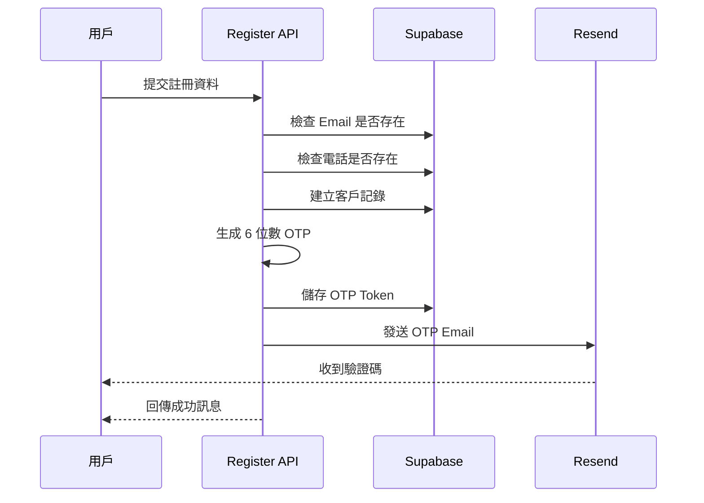
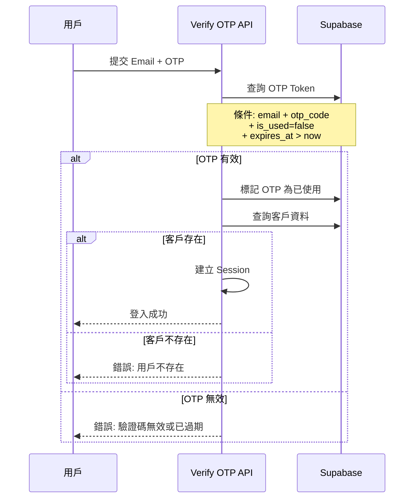

# OTP 問題排查與解決方案

## 📋 問題總結

### 問題 1: Email 未收到認證碼
**狀態**: ✅ **已解決**

**診斷結果**:
- Resend API 連線正常
- Email 已成功發送
- 測試郵件已收到

**原因**:
- 發件人顯示為 `onboarding@resend.dev` 而非 `noreply@qwerboy.com`
- 這是因為 Resend 在測試模式下的預設行為
- 郵件可能進入垃圾郵件匣

**解決方案**:
1. ✅ 檢查垃圾郵件匣
2. ⚠️ 如需使用自訂網域，需在 [Resend Dashboard](https://resend.com/domains) 驗證網域

---

### 問題 2: 從 Supabase OTP 欄位輸入認證碼顯示「用戶不存在」
**狀態**: 🔍 **需要進一步測試**

**診斷結果**:
- 用戶資料存在於資料庫
  - 客戶 ID: `021d0441-eeb3-4b05-960e-2428cc1bfb0e`
  - Email: `qwerboy@gmail.com`
  - 姓名: `LIU HSIANGHUNG`
- OTP 記錄已建立（驗證碼: `789456`，狀態: 已使用）

**可能原因**:
1. **Email 大小寫不一致**
   - 資料庫查詢使用 `email.toLowerCase()`
   - 確認輸入的 Email 是否完全一致

2. **OTP 已使用或過期**
   - 每個 OTP 只能使用一次
   - OTP 有效期為 10 分鐘

3. **驗證流程問題**
   - 可能在驗證前用戶資料未正確建立

---

## 🔧 解決步驟

### 步驟 1: 測試完整註冊流程

1. **啟動開發伺服器**
   ```powershell
   npm run dev
   ```

2. **開啟註冊頁面**
   ```
   http://localhost:3000/register
   ```

3. **使用測試資料註冊**
   - Email: `qwerboy@gmail.com`
   - 姓名: 任意
   - 電話: 任意（10 碼）

4. **檢查 Email**
   - 查看收件匣和垃圾郵件
   - 發件人可能顯示為 `onboarding@resend.dev`

5. **輸入驗證碼**
   - 使用 Email 中收到的 6 位數驗證碼
   - 或從 Supabase `otp_tokens` 表查詢最新的未使用驗證碼

---

### 步驟 2: 使用診斷工具

#### 2.1 檢查整體狀態
```powershell
node scripts/diagnose-registration.js
```

**功能**:
- 檢查 Supabase 連線
- 查詢客戶資料
- 查詢 OTP 記錄
- 發送測試郵件

#### 2.2 互動式 OTP 測試（需要開發伺服器運行）
```powershell
node scripts/test-otp-verification.js
```

**功能**:
1. 發送新的 OTP
2. 查看現有的 OTP
3. 驗證 OTP
4. 完整測試（發送 + 驗證）

---

## 📊 驗證流程說明

### 註冊流程 (POST /api/auth/register)



### 驗證流程 (POST /api/auth/verify-otp)



---

## 🐛 常見錯誤與解決方案

### 錯誤 1: "用戶不存在"

**原因**:
- 客戶記錄未成功建立
- Email 大小寫不一致
- 使用了錯誤的 Email

**檢查方法**:
```sql
-- 在 Supabase SQL Editor 執行
SELECT * FROM customers 
WHERE email = 'qwerboy@gmail.com';
```

**解決方案**:
1. 確認 Email 完全一致（包含大小寫）
2. 檢查註冊 API 是否有錯誤訊息
3. 使用診斷工具檢查資料庫狀態

---

### 錯誤 2: "驗證碼無效或已過期"

**原因**:
- OTP 已使用（每個 OTP 只能用一次）
- OTP 已過期（10 分鐘有效期）
- 輸入的驗證碼錯誤

**檢查方法**:
```sql
-- 查詢最新的 OTP
SELECT otp_code, is_used, expires_at, created_at
FROM otp_tokens
WHERE email = 'qwerboy@gmail.com'
ORDER BY created_at DESC
LIMIT 5;
```

**解決方案**:
1. 重新發送 OTP
2. 確認驗證碼輸入正確
3. 檢查系統時間是否正確

---

**檢查方法**:
1. **使用 Resend 專用測試腳本**:
   ```powershell
   node scripts/test-resend.js
   ```
   此腳本會檢查 `RESEND_API_KEY` 並發送一封測試郵件。

2. **原本的測試腳本**:
   ```powershell
   node scripts/test-email.js
   ```

**解決方案**:
1. 檢查垃圾郵件匣
2. 搜尋發件人 `onboarding@resend.dev` 或您的自訂網域
3. 查看開發伺服器控制台的錯誤訊息
4. 使用診斷工具直接查詢資料庫中的 OTP
5. 確保 `.env.local` 中的 `RESEND_FROM_EMAIL` 已正確設定為已驗證的網域

---

## 🔐 手動驗證 OTP（緊急方案）

如果 Email 始終收不到，可以直接從資料庫查詢 OTP：

### 方法 1: 使用 Supabase Dashboard

1. 登入 [Supabase Dashboard](https://supabase.com/dashboard)
2. 選擇專案
3. 進入 Table Editor
4. 選擇 `otp_tokens` 表
5. 篩選條件:
   - `email` = 您的 Email
   - `is_used` = `false`
   - `expires_at` > 現在時間
6. 查看 `otp_code` 欄位

### 方法 2: 使用診斷腳本

```powershell
node scripts/diagnose-registration.js
```

腳本會顯示最近的 OTP 記錄，包含驗證碼。

---

## 📝 測試檢查清單

- [ ] 環境變數設定正確
  - [ ] `RESEND_API_KEY`
  - [ ] `RESEND_FROM_EMAIL`
  - [ ] `NEXT_PUBLIC_SUPABASE_URL`
  - [ ] `SUPABASE_SERVICE_ROLE_KEY`
  - [ ] `JWT_SECRET`

- [ ] Supabase 連線正常
  - [ ] 可以查詢 `customers` 表
  - [ ] 可以查詢 `otp_tokens` 表

- [ ] Resend Email 正常
  - [ ] 測試郵件發送成功
  - [ ] 收到測試郵件（檢查垃圾郵件）

- [ ] 註冊流程正常
  - [ ] 可以建立客戶記錄
  - [ ] 可以建立 OTP Token
  - [ ] 可以發送 OTP Email

- [ ] 驗證流程正常
  - [ ] 可以驗證 OTP
  - [ ] 可以建立 Session
  - [ ] 可以登入成功

---

## 🚀 生產環境建議

### 1. 驗證自訂網域

**目的**: 使用 `noreply@qwerboy.com` 作為發件人

**步驟**:
1. 登入 [Resend Dashboard](https://resend.com/domains)
2. 點擊 "Add Domain"
3. 輸入 `qwerboy.com`
4. 按照指示設定 DNS 記錄:
   - SPF 記錄
   - DKIM 記錄
   - DMARC 記錄（可選）
5. 等待驗證完成（通常 5-30 分鐘）
6. 更新 `.env.local`:
   ```
   RESEND_FROM_EMAIL=noreply@qwerboy.com
   ```

### 2. 監控 Email 發送

建議設定監控來追蹤 Email 發送狀態：

```typescript
// lib/email/resend.ts
export async function sendOTPEmail(to: string, otpCode: string): Promise<void> {
  try {
    const result = await resend.emails.send({
      from: config.resend.fromEmail,
      to,
      subject: '您的登入驗證碼',
      html: `...`,
    });
    
    // 記錄成功
    console.log('Email sent successfully:', {
      id: result.id,
      to,
      timestamp: new Date().toISOString()
    });
    
  } catch (error) {
    // 記錄失敗
    console.error('Email sending failed:', {
      to,
      error: error.message,
      timestamp: new Date().toISOString()
    });
    
    throw new Error('無法發送驗證碼 Email，請稍後再試');
  }
}
```

### 3. 設定 Email 範本

考慮使用 Resend 的 Email 範本功能，提供更好的維護性。

---

## 📞 需要協助？

如果問題仍未解決，請提供以下資訊：

1. **診斷腳本輸出**
   ```powershell
   node scripts/diagnose-registration.js > diagnosis.txt
   ```

2. **開發伺服器控制台錯誤**
   - 複製完整的錯誤訊息

3. **瀏覽器控制台錯誤**
   - 開啟 DevTools (F12)
   - 複製 Console 和 Network 的錯誤

4. **測試步驟**
   - 詳細描述您執行的操作
   - 預期結果 vs 實際結果

---

## 📚 相關文件

- [Resend 官方文件](https://resend.com/docs)
- [Supabase 官方文件](https://supabase.com/docs)
- [專案 SETUP.md](../SETUP.md)
- [Email 設定文件](./RESEND_EMAIL_SETUP.md)
- [註冊 OTP 實作文件](./REGISTER_OTP_IMPLEMENTATION.md)

---

**最後更新**: 2026-01-29
**版本**: 1.1.0

