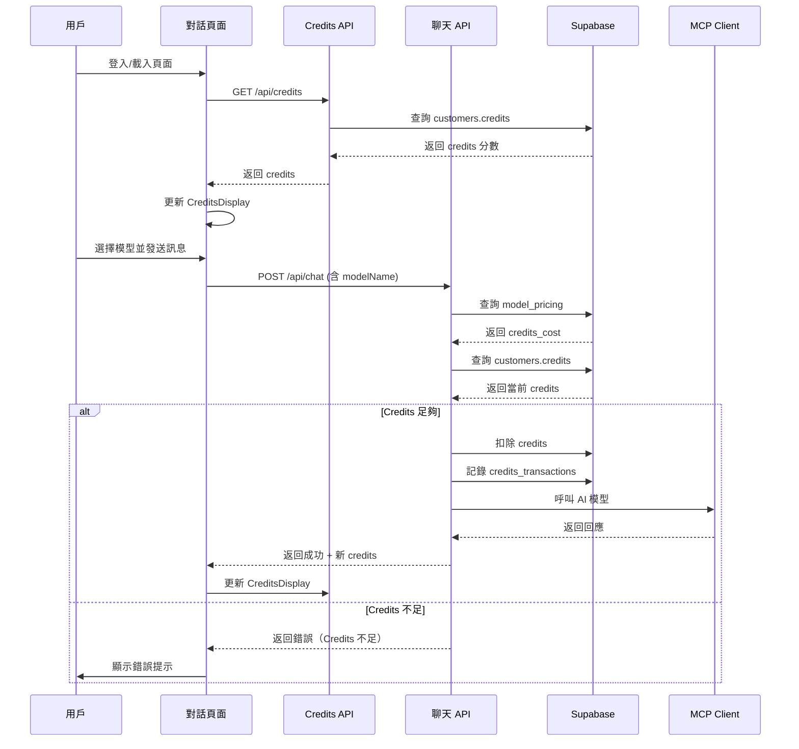

# Credits 系統與模型管理實作計劃

## 資料庫變更

### 1. 新增 Migration 檔案

建立 `supabase/migrations/003_add_credits_system.sql`：

- **customers 表新增欄位**：
  - `credits INTEGER DEFAULT 0 NOT NULL` - 用戶 Credits 分數

- **新增 model_pricing 表**：
  - `id UUID PRIMARY KEY`
  - `model_name VARCHAR(255) UNIQUE NOT NULL` - 模型名稱（如 claude-sonnet-4-20250514）
  - `display_name VARCHAR(255) NOT NULL` - 顯示名稱
  - `credits_cost INTEGER NOT NULL` - 每次使用消耗的點數
  - `is_active BOOLEAN DEFAULT true` - 是否啟用
  - `created_at TIMESTAMP WITH TIME ZONE`
  - `updated_at TIMESTAMP WITH TIME ZONE`

- **新增 credits_transactions 表**（消費歷史）：
  - `id UUID PRIMARY KEY`
  - `customer_id UUID REFERENCES customers(id)`
  - `conversation_id UUID REFERENCES chat_conversations(id)`
  - `model_name VARCHAR(255) NOT NULL` - 使用的模型
  - `credits_cost INTEGER NOT NULL` - 消耗的點數
  - `credits_before INTEGER NOT NULL` - 消費前餘額
  - `credits_after INTEGER NOT NULL` - 消費後餘額
  - `created_at TIMESTAMP WITH TIME ZONE`

- **chat_conversations 表新增欄位**：
  - `model_name VARCHAR(255)` - 使用的模型名稱

### 2. 初始化模型定價資料

在 migration 中插入預設模型：

- `claude-sonnet-4-20250514` - 10 點
- `claude-3-haiku-20240307` - 5 點

## 後端 API 實作

### 3. 建立模型定價管理函數

`lib/supabase/model-pricing.ts`：

- `getAllModels()` - 取得所有啟用的模型
- `getModelPricing(modelName: string)` - 取得特定模型的定價
- `createModel(model: {...})` - 建立新模型（管理員用）
- `updateModelPricing(modelName: string, creditsCost: number)` - 更新模型定價

### 4. 建立 Credits 管理函數

`lib/supabase/credits.ts`：

- `getCustomerCredits(customerId: string)` - 取得用戶 Credits
- `deductCredits(customerId: string, amount: number, modelName: string, conversationId: string)` - 扣除 Credits 並記錄交易
- `addCredits(customerId: string, amount: number)` - 增加 Credits（管理員用）
- `getCreditsHistory(customerId: string, limit?: number)` - 取得消費歷史

### 5. 更新登入 API

修改 `app/api/auth/login/route.ts`、`app/api/auth/verify-otp/route.ts`、`app/api/auth/google/route.ts`：

- 登入成功後查詢並返回用戶的 Credits 分數

### 6. 新增取得 Credits API

`app/api/credits/route.ts`：

- `GET /api/credits` - 取得當前用戶的 Credits 分數
- `GET /api/credits/history` - 取得消費歷史

### 7. 更新聊天 API

修改 `app/api/chat/route.ts`：

- 接收 `modelName` 參數
- 在呼叫 MCP Client 前檢查 Credits 是否足夠
- 如果不足，返回錯誤
- 如果足夠，扣除 Credits 並記錄交易
- 更新 `chat_conversations.model_name`

### 8. 更新 MCP Client

修改 `lib/mcp/client.ts`：

- `sendMessage` 方法接收 `modelName` 參數
- 根據 `modelName` 選擇對應的 Anthropic 模型

### 9. 管理員 API - 模型定價管理

`app/api/admin/models/route.ts`：

- `GET /api/admin/models` - 取得所有模型列表
- `POST /api/admin/models` - 建立新模型
- `PUT /api/admin/models/:modelName` - 更新模型定價
- `DELETE /api/admin/models/:modelName` - 停用模型

`app/api/admin/credits/route.ts`：

- `POST /api/admin/credits/add` - 為用戶增加 Credits

## 前端實作

### 10. 更新類型定義

`types/index.ts`：

- `Customer` 介面新增 `credits: number`
- 新增 `ModelPricing` 介面
- 新增 `CreditsTransaction` 介面

### 11. 建立 Credits 顯示元件

`components/chat/CreditsDisplay.tsx`：

- 顯示當前 Credits 分數
- 從 API 取得並更新 Credits

### 12. 建立模型選擇器元件

`components/chat/ModelSelector.tsx`：

- 從 API 取得可用模型列表
- 顯示模型名稱和消耗點數
- 允許用戶選擇模型

### 13. 更新 ChatInput 元件

`components/chat/ChatInput.tsx`：

- 整合 `ModelSelector` 元件
- 在 `onSend` 中傳遞 `modelName`

### 14. 更新對話頁面

`app/(main)/chat/page.tsx`：

- 在右上角顯示 `CreditsDisplay` 元件（與下載記錄按鈕一起）
- 在頁面載入時取得並更新 Credits
- 在 `handleSend` 中處理 Credits 不足的情況

### 15. 更新主布局

`app/(main)/layout.tsx`：

- 在登入時取得並顯示 Credits（可選，或只在對話頁面顯示）

### 16. 管理員後台 - 模型管理頁面

`app/(admin)/admin/models/page.tsx`：

- 顯示模型列表（名稱、消耗點數、狀態）
- 提供新增、編輯、停用功能
- 使用表格展示

### 17. 管理員後台 - Credits 管理

在 `app/(admin)/admin/page.tsx` 或新建頁面：

- 顯示用戶列表及其 Credits
- 提供為用戶增加 Credits 的功能

## 驗證與錯誤處理

### 18. 更新驗證 Schema

`lib/validation/schemas.ts`：

- `chatMessageSchema` 新增 `modelName` 欄位（可選，有預設值）

### 19. 錯誤處理

- Credits 不足時返回明確的錯誤訊息
- 模型不存在時返回錯誤
- 資料庫操作失敗時的錯誤處理

## 資料流程圖



## TDD 開發模式

### 測試框架設置

使用 **Vitest** + **@testing-library/react** 進行單元測試與整合測試：

```bash
npm install -D vitest @testing-library/react @testing-library/jest-dom @testing-library/user-event jsdom
```

### TDD 開發流程（Red-Green-Refactor）

每個功能模組遵循以下流程：

1. **Red**: 先寫測試，確保測試失敗
2. **Green**: 寫最少的代碼讓測試通過
3. **Refactor**: 重構代碼，保持測試通過

### 測試覆蓋範圍

#### 後端函數測試

- `lib/supabase/credits.ts` - Credits 管理邏輯
  - ✅ 取得 Credits
  - ✅ 扣除 Credits（足夠/不足）
  - ✅ 記錄交易歷史
  - ✅ 增加 Credits
  - ✅ 取得消費歷史

- `lib/supabase/model-pricing.ts` - 模型定價管理
  - ✅ 取得所有啟用模型
  - ✅ 取得特定模型定價
  - ✅ 建立新模型
  - ✅ 更新模型定價

#### API 路由測試

- `app/api/credits/route.ts`
  - ✅ GET - 取得 Credits（成功/未授權）
  - ✅ GET /history - 取得消費歷史

- `app/api/chat/route.ts`
  - ✅ Credits 足夠時正常扣除
  - ✅ Credits 不足時返回錯誤
  - ✅ 模型不存在時返回錯誤
  - ✅ 扣除 Credits 後記錄交易

- `app/api/admin/models/route.ts`
  - ✅ 管理員權限驗證
  - ✅ CRUD 操作測試

#### 前端元件測試

- `components/chat/CreditsDisplay.tsx`
  - ✅ 顯示 Credits 分數
  - ✅ 載入狀態
  - ✅ 錯誤處理

- `components/chat/ModelSelector.tsx`
  - ✅ 顯示模型列表
  - ✅ 選擇模型
  - ✅ 顯示消耗點數

#### 整合測試

- 完整對話流程（選擇模型 → 發送 → 扣除 Credits）
- 登入後 Credits 更新流程
- 管理員管理模型流程

## 實作順序（TDD 模式）

### Phase 1: 測試環境設置

1. ✅ 安裝測試框架與依賴
2. ✅ 配置 Vitest（`vitest.config.ts`）
3. ✅ 建立測試工具函數（mock Supabase、session 等）

### Phase 2: 資料庫層（TDD）

1. **Red**: 寫 Migration 測試（驗證表結構）
2. **Green**: 建立 Migration（步驟 1-2）
3. **Refactor**: 優化索引與約束

### Phase 3: 後端函數層（TDD）

1. **Red**: 寫 `lib/supabase/credits.ts` 測試
2. **Green**: 實作 `lib/supabase/credits.ts`（步驟 4）
3. **Refactor**: 優化錯誤處理

4. **Red**: 寫 `lib/supabase/model-pricing.ts` 測試
5. **Green**: 實作 `lib/supabase/model-pricing.ts`（步驟 3）
6. **Refactor**: 優化查詢效能

### Phase 4: API 層（TDD）

1. **Red**: 寫 `/api/credits` 測試
2. **Green**: 實作 `/api/credits/route.ts`（步驟 6）
3. **Refactor**: 優化回應格式

4. **Red**: 寫 `/api/chat` Credits 相關測試
5. **Green**: 更新 `/api/chat/route.ts`（步驟 7）
6. **Refactor**: 優化錯誤訊息

7. **Red**: 寫登入 API 返回 Credits 測試
8. **Green**: 更新登入 API（步驟 5）
9. **Refactor**: 統一回應格式

### Phase 5: MCP Client（TDD）

1. **Red**: 寫模型選擇測試
2. **Green**: 更新 `lib/mcp/client.ts`（步驟 8）
3. **Refactor**: 優化模型映射

### Phase 6: 前端元件（TDD）

1. **Red**: 寫 `CreditsDisplay` 測試
2. **Green**: 實作 `CreditsDisplay.tsx`（步驟 11）
3. **Refactor**: 優化 UI/UX

4. **Red**: 寫 `ModelSelector` 測試
5. **Green**: 實作 `ModelSelector.tsx`（步驟 12）
6. **Refactor**: 優化選擇邏輯

7. **Red**: 寫 `ChatInput` 整合測試
8. **Green**: 更新 `ChatInput.tsx`（步驟 13）
9. **Refactor**: 優化狀態管理

### Phase 7: 頁面整合（TDD）

1. **Red**: 寫對話頁面 Credits 顯示測試
2. **Green**: 更新 `chat/page.tsx`（步驟 14）
3. **Refactor**: 優化載入流程

### Phase 8: 管理員功能（TDD）

1. **Red**: 寫管理員 API 測試
2. **Green**: 實作管理員 API（步驟 9）
3. **Refactor**: 優化權限檢查

4. **Red**: 寫管理員頁面測試
5. **Green**: 實作管理員頁面（步驟 16-17）
6. **Refactor**: 優化 UI

### Phase 9: 整合測試與優化

1. ✅ E2E 測試（完整用戶流程）
2. ✅ 效能測試（並發請求）
3. ✅ 錯誤處理測試（邊界情況）
4. ✅ 重構與優化（步驟 18-19）

## 測試檔案結構

```
__tests__/
  ├── lib/
  │   ├── supabase/
  │   │   ├── credits.test.ts
  │   │   └── model-pricing.test.ts
  │   └── mcp/
  │       └── client.test.ts
  ├── api/
  │   ├── credits/
  │   │   └── route.test.ts
  │   ├── chat/
  │   │   └── route.test.ts
  │   └── admin/
  │       ├── models/
  │       │   └── route.test.ts
  │       └── credits/
  │           └── route.test.ts
  ├── components/
  │   └── chat/
  │       ├── CreditsDisplay.test.tsx
  │       └── ModelSelector.test.tsx
  └── integration/
      ├── chat-flow.test.ts
      └── credits-flow.test.ts
```

## 測試工具與 Mock

### Mock Supabase Client

```typescript
// __tests__/utils/mock-supabase.ts
export const mockSupabaseClient = {
  from: jest.fn(() => ({
    select: jest.fn().mockReturnThis(),
    insert: jest.fn().mockReturnThis(),
    update: jest.fn().mockReturnThis(),
    delete: jest.fn().mockReturnThis(),
    eq: jest.fn().mockReturnThis(),
    single: jest.fn(),
  })),
};
```

### Mock Session

```typescript
// __tests__/utils/mock-session.ts
export const mockSession = {
  customerId: 'test-customer-id',
  email: 'test@example.com',
};
```

## 測試覆蓋率目標

- **單元測試**: ≥ 90%
- **整合測試**: 覆蓋所有主要流程
- **關鍵邏輯**: 100% 覆蓋（Credits 扣除、模型選擇、錯誤處理）

## 測試範例

### 範例 1: Credits 管理函數測試

```typescript
// __tests__/lib/supabase/credits.test.ts
import { describe, it, expect, beforeEach, vi } from 'vitest';
import { getCustomerCredits, deductCredits } from '@/lib/supabase/credits';
import { mockSupabaseClient } from '../utils/mock-supabase';

describe('Credits Management', () => {
  beforeEach(() => {
    vi.clearAllMocks();
  });

  describe('getCustomerCredits', () => {
    it('應該返回用戶的 Credits 分數', async () => {
      const customerId = 'test-id';
      const mockCredits = 100;
      
      mockSupabaseClient.from.mockReturnValue({
        select: vi.fn().mockReturnThis(),
        eq: vi.fn().mockReturnThis(),
        single: vi.fn().mockResolvedValue({
          data: { credits: mockCredits },
          error: null,
        }),
      });

      const credits = await getCustomerCredits(customerId);
      expect(credits).toBe(mockCredits);
    });

    it('應該在用戶不存在時返回 0', async () => {
      mockSupabaseClient.from.mockReturnValue({
        select: vi.fn().mockReturnThis(),
        eq: vi.fn().mockReturnThis(),
        single: vi.fn().mockResolvedValue({
          data: null,
          error: { message: 'Not found' },
        }),
      });

      const credits = await getCustomerCredits('non-existent');
      expect(credits).toBe(0);
    });
  });

  describe('deductCredits', () => {
    it('應該在 Credits 足夠時成功扣除', async () => {
      const customerId = 'test-id';
      const amount = 10;
      const creditsBefore = 100;
      const creditsAfter = 90;

      // Mock 查詢 Credits
      mockSupabaseClient.from.mockReturnValueOnce({
        select: vi.fn().mockReturnThis(),
        eq: vi.fn().mockReturnThis(),
        single: vi.fn().mockResolvedValue({
          data: { credits: creditsBefore },
          error: null,
        }),
      });

      // Mock 更新 Credits
      mockSupabaseClient.from.mockReturnValueOnce({
        update: vi.fn().mockReturnThis(),
        eq: vi.fn().mockResolvedValue({
          data: { credits: creditsAfter },
          error: null,
        }),
      });

      // Mock 記錄交易
      mockSupabaseClient.from.mockReturnValueOnce({
        insert: vi.fn().mockResolvedValue({
          data: { id: 'transaction-id' },
          error: null,
        }),
      });

      const result = await deductCredits(customerId, amount, 'claude-sonnet-4-20250514', 'conv-id');
      expect(result.success).toBe(true);
      expect(result.creditsAfter).toBe(creditsAfter);
    });

    it('應該在 Credits 不足時返回錯誤', async () => {
      const customerId = 'test-id';
      const amount = 100;
      const creditsBefore = 50; // 不足

      mockSupabaseClient.from.mockReturnValue({
        select: vi.fn().mockReturnThis(),
        eq: vi.fn().mockReturnThis(),
        single: vi.fn().mockResolvedValue({
          data: { credits: creditsBefore },
          error: null,
        }),
      });

      const result = await deductCredits(customerId, amount, 'claude-sonnet-4-20250514', 'conv-id');
      expect(result.success).toBe(false);
      expect(result.error).toContain('Credits 不足');
    });
  });
});
```

### 範例 2: API 路由測試

```typescript
// __tests__/api/chat/route.test.ts
import { describe, it, expect, beforeEach, vi } from 'vitest';
import { POST } from '@/app/api/chat/route';
import { NextRequest } from 'next/server';
import { mockSession, mockSupabaseClient } from '../../utils';

describe('POST /api/chat', () => {
  beforeEach(() => {
    vi.clearAllMocks();
  });

  it('應該在 Credits 不足時返回錯誤', async () => {
    const request = new NextRequest('http://localhost/api/chat', {
      method: 'POST',
      body: JSON.stringify({
        message: '測試訊息',
        modelName: 'claude-sonnet-4-20250514',
        workloadLevel: 'standard',
      }),
      headers: {
        cookie: 'session=test-token',
      },
    });

    // Mock session 驗證
    vi.mock('@/lib/auth/session', () => ({
      verifySession: vi.fn().mockResolvedValue(mockSession),
    }));

    // Mock Credits 不足
    vi.mock('@/lib/supabase/credits', () => ({
      getCustomerCredits: vi.fn().mockResolvedValue(5), // 只有 5 點
      getModelPricing: vi.fn().mockResolvedValue({ credits_cost: 10 }), // 需要 10 點
    }));

    const response = await POST(request);
    const data = await response.json();

    expect(response.status).toBe(400);
    expect(data.success).toBe(false);
    expect(data.error).toContain('Credits 不足');
  });

  it('應該在 Credits 足夠時成功處理並扣除', async () => {
    // ... 測試實作
  });
});
```

### 範例 3: React 元件測試

```typescript
// __tests__/components/chat/CreditsDisplay.test.tsx
import { describe, it, expect, beforeEach, vi } from 'vitest';
import { render, screen, waitFor } from '@testing-library/react';
import { CreditsDisplay } from '@/components/chat/CreditsDisplay';

// Mock fetch
global.fetch = vi.fn();

describe('CreditsDisplay', () => {
  beforeEach(() => {
    vi.clearAllMocks();
  });

  it('應該顯示 Credits 分數', async () => {
    const mockCredits = 100;
    
    (global.fetch as any).mockResolvedValueOnce({
      ok: true,
      json: async () => ({ success: true, data: { credits: mockCredits } }),
    });

    render(<CreditsDisplay />);

    await waitFor(() => {
      expect(screen.getByText(`Credits: ${mockCredits}`)).toBeInTheDocument();
    });
  });

  it('應該在載入時顯示載入狀態', () => {
    (global.fetch as any).mockImplementation(() => new Promise(() => {})); // 永不 resolve

    render(<CreditsDisplay />);
    expect(screen.getByText('載入中...')).toBeInTheDocument();
  });

  it('應該在錯誤時顯示錯誤訊息', async () => {
    (global.fetch as any).mockRejectedValueOnce(new Error('Network error'));

    render(<CreditsDisplay />);

    await waitFor(() => {
      expect(screen.getByText(/載入失敗/)).toBeInTheDocument();
    });
  });
});
```

## TDD 檢查清單

每個功能開發時確認：

- [ ] **Red**: 測試先寫，且測試失敗（預期行為）
- [ ] **Green**: 實作最少的代碼讓測試通過
- [ ] **Refactor**: 重構代碼，測試仍然通過
- [ ] **邊界情況**: 測試錯誤情況（Credits 不足、模型不存在等）
- [ ] **整合測試**: 測試完整流程
- [ ] **測試覆蓋率**: 關鍵邏輯達到 100% 覆蓋