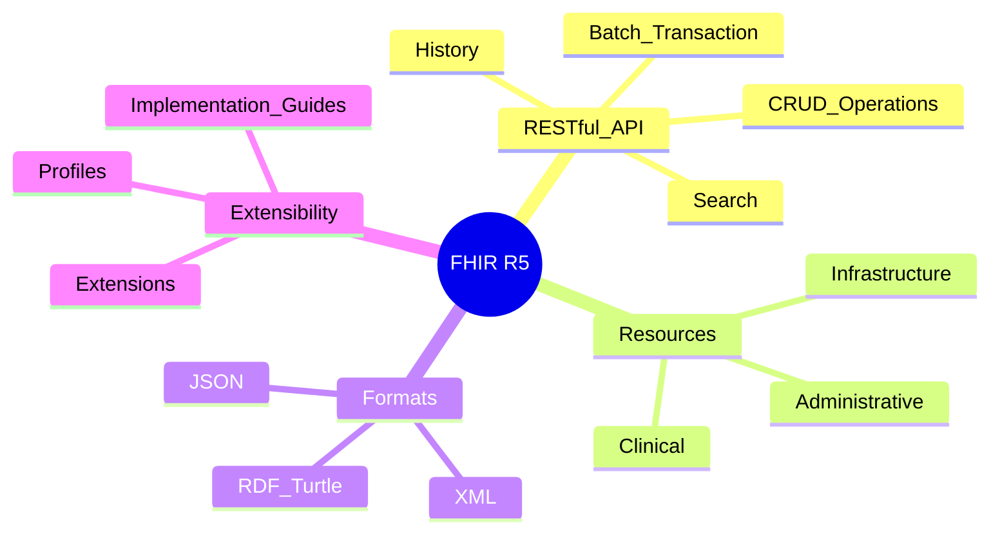
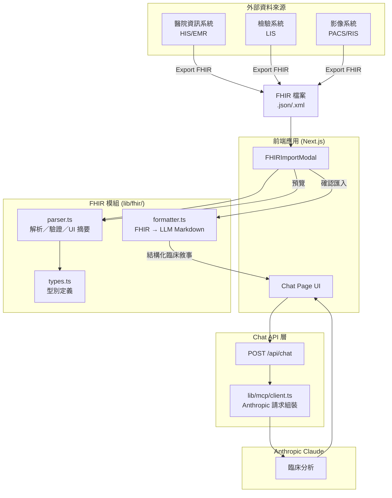
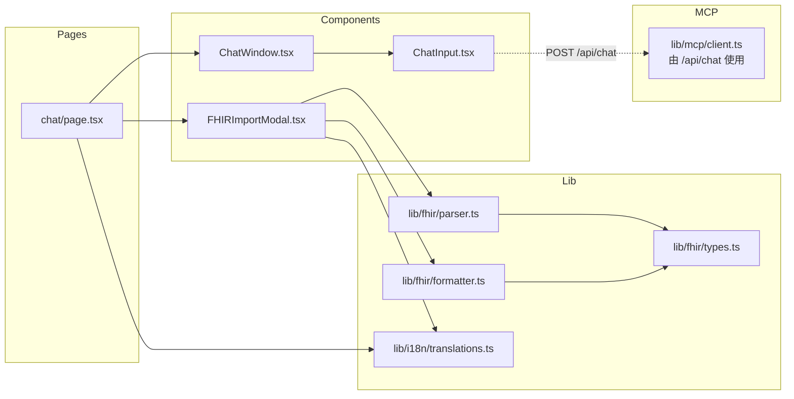
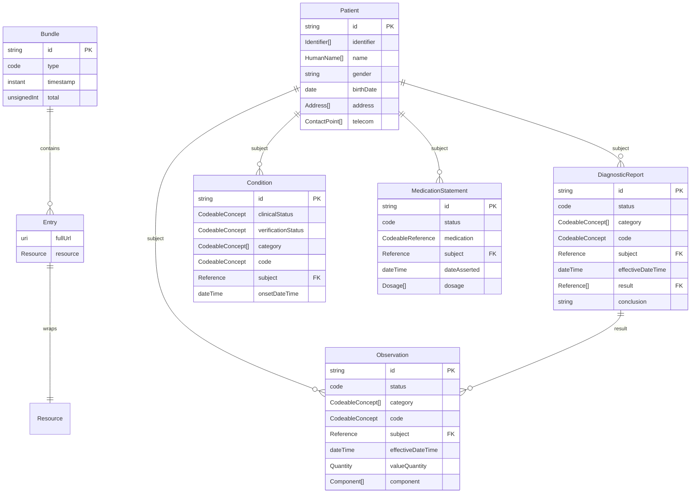
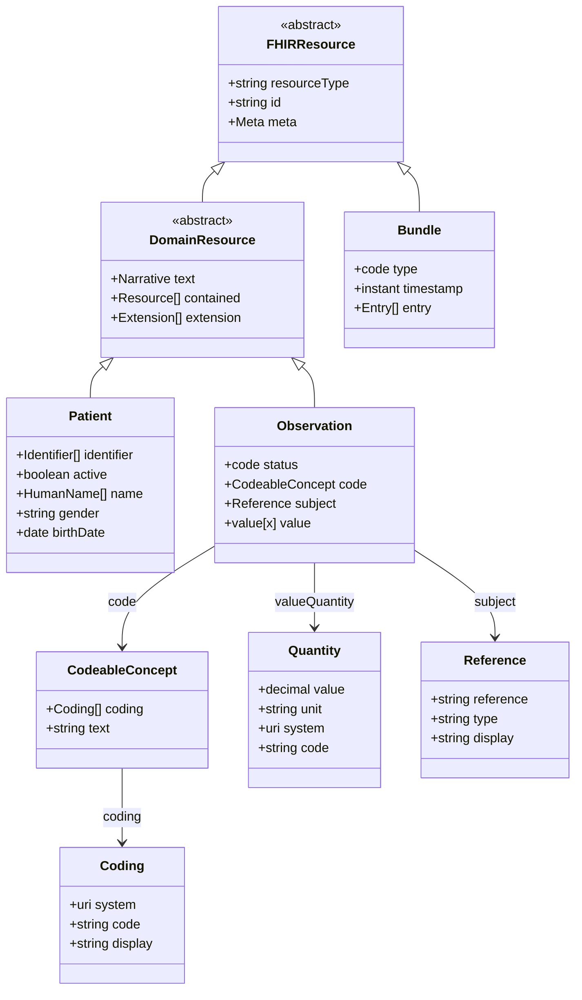
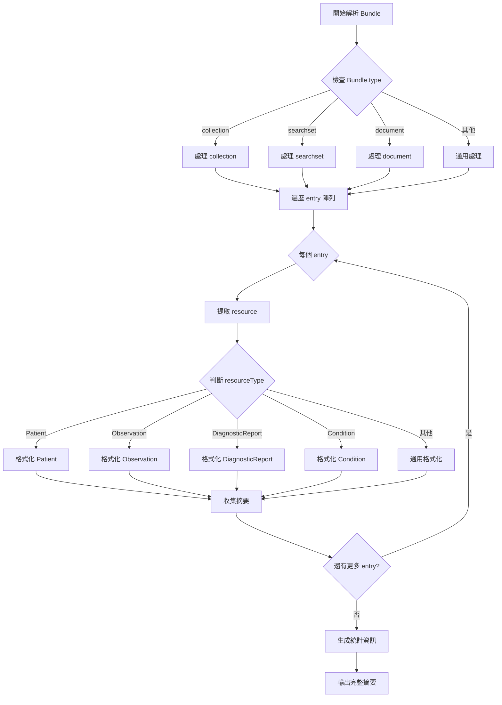
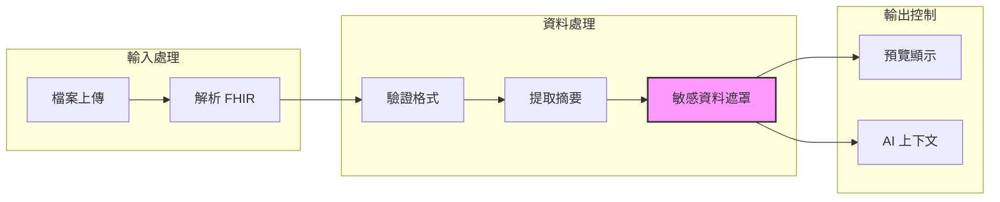
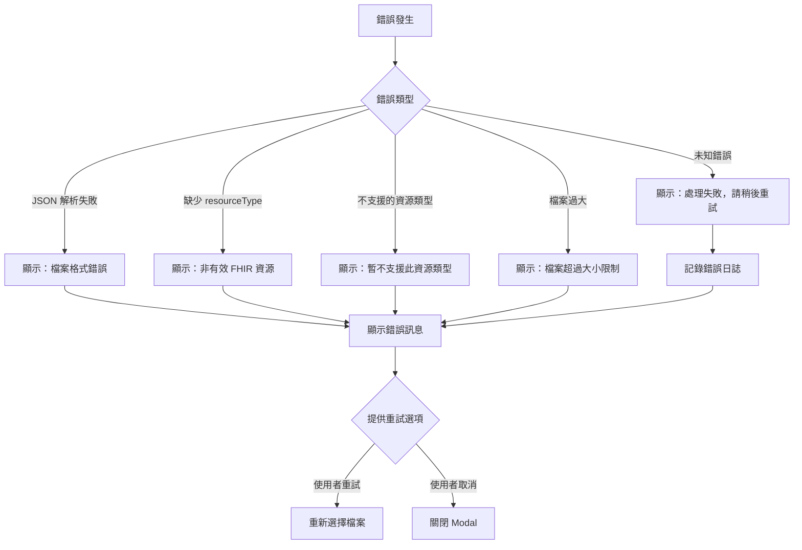
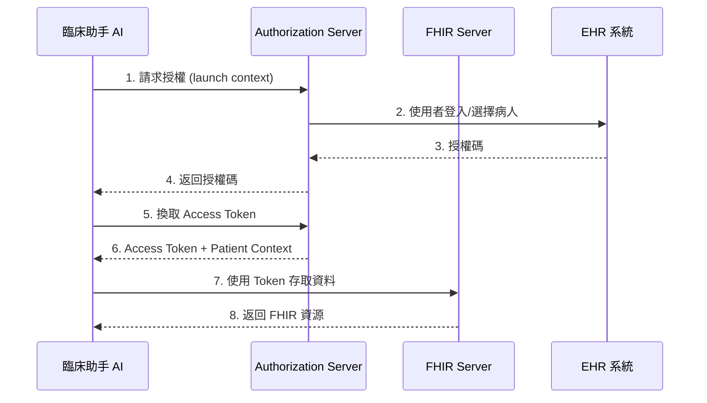

# HL7 FHIR 系統架構文件

> 文件版本: 1.1.0  
> 對應應用程式版本: **1.3.0**（`package.json`）  
> 最後更新: 2026-03-27  
> 依據規範: [HL7 FHIR R5](https://hl7.org/fhir/)

## 目錄

1. [FHIR 標準概述](#1-fhir-標準概述)
2. [系統整合架構](#2-系統整合架構)
3. [FHIR 資源模型](#3-fhir-資源模型)
4. [資料流程設計](#4-資料流程設計)
5. [類型定義架構](#5-類型定義架構)
6. [安全性考量](#6-安全性考量)
7. [錯誤處理策略](#7-錯誤處理策略)
8. [未來擴充計畫](#8-未來擴充計畫)

---

## 1. FHIR 標準概述

HL7 FHIR (Fast Healthcare Interoperability Resources) 是由 HL7 International 發布的醫療資料交換標準（R5 版本）。FHIR 結合了 HL7 v2、v3 和 CDA 的優點，並採用現代 Web 技術。

### 1.1 FHIR 核心特性



### 1.2 FHIR 規範層級

| 層級 | 說明 | 本專案支援 |
|------|------|-----------|
| Level 1 | 基礎框架 (Foundation) | Datatypes, Extensions |
| Level 2 | 實作支援 (Implementer Support) | Conformance, Terminology |
| Level 3 | 管理資源 (Administration) | Patient, Practitioner |
| Level 4 | 臨床記錄 (Clinical) | Observation, Condition, DiagnosticReport |
| Level 5 | 臨床推理 (Clinical Reasoning) | 未來擴充 |

### 1.3 JSON 格式規範

依據 [FHIR JSON 規範](https://hl7.org/fhir/json.html)：

- **MIME 類型**: `application/fhir+json`
- **resourceType**: 必填欄位，標識資源類型
- **陣列處理**: 可重複元素始終以陣列表示，即使只有一個值
- **原始類型**: 
  - `integer`, `decimal` → JSON number
  - `boolean` → JSON boolean
  - 其他類型 → JSON string

---

## 2. 系統整合架構

### 2.1 整體架構圖



### 2.2 組件依賴關係



### 2.3 檔案結構

```
Health Care Assistant/
├── app/
│   └── (main)/
│       └── chat/
│           └── page.tsx          # Chat 頁面（整合 FHIR 匯入）
├── components/
│   ├── chat/
│   │   ├── ChatWindow.tsx
│   │   └── ChatInput.tsx
│   └── fhir/
│       └── FHIRImportModal.tsx   # FHIR 匯入 Modal
├── lib/
│   ├── fhir/
│   │   ├── types.ts              # FHIR 類型定義
│   │   ├── parser.ts             # 解析、驗證、UI 摘要（formatFHIRSummary）
│   │   └── formatter.ts        # FHIR → LLM 用的 Markdown 臨床敘事（formatFHIRForLLM）
│   ├── mcp/
│   │   └── client.ts             # Anthropic API：偵測 FHIR 標記並追加臨床分析 system 提示
│   └── i18n/
│       └── translations.ts       # 國際化翻譯
├── __tests__/
│   ├── fixtures/
│   │   └── fhir/                 # 測試資料
│   ├── lib/
│   │   └── fhir/
│   │       ├── parser.test.ts
│   │       └── formatter.test.ts
│   ├── integration/
│   │   ├── fhir.integration.test.ts
│   │   └── fhir-formatter.integration.test.ts
│   └── components/
│       └── fhir/
│           └── FHIRImportModal.test.tsx
└── docs/
    └── FHIR-ARCHITECTURE.md      # 本文件
```

---

## 3. FHIR 資源模型

### 3.1 支援的資源類型



### 3.2 資料類型層級



### 3.3 資源詳細規格

#### Patient 資源

| 欄位 | 類型 | 必填 | 說明 |
|------|------|------|------|
| resourceType | string | ✓ | 固定為 "Patient" |
| id | string | | 資源識別碼 |
| identifier | Identifier[] | | 身份識別碼（如身份證號） |
| active | boolean | | 記錄是否啟用中 |
| name | HumanName[] | | 姓名 |
| telecom | ContactPoint[] | | 聯絡方式 |
| gender | code | | male / female / other / unknown |
| birthDate | date | | 出生日期 (YYYY-MM-DD) |
| address | Address[] | | 地址 |

#### Observation 資源

| 欄位 | 類型 | 必填 | 說明 |
|------|------|------|------|
| resourceType | string | ✓ | 固定為 "Observation" |
| status | code | ✓ | registered / preliminary / final / amended |
| category | CodeableConcept[] | | 分類（如 vital-signs, laboratory） |
| code | CodeableConcept | ✓ | 檢驗項目代碼（通常使用 LOINC） |
| subject | Reference | | 受檢者（通常為 Patient） |
| effectiveDateTime | dateTime | | 檢驗時間 |
| valueQuantity | Quantity | | 數值結果 |
| valueCodeableConcept | CodeableConcept | | 代碼結果 |
| valueString | string | | 文字結果 |
| component | Component[] | | 複合項目（如血壓的收縮壓/舒張壓） |

#### Bundle 資源

| 欄位 | 類型 | 必填 | 說明 |
|------|------|------|------|
| resourceType | string | ✓ | 固定為 "Bundle" |
| type | code | ✓ | document / message / transaction / batch / searchset / collection |
| timestamp | instant | | 建立時間 |
| total | unsignedInt | | 總數（用於 searchset） |
| entry | Entry[] | | 包含的資源列表 |

---

## 4. 資料流程設計

### 4.1 匯入流程時序圖

```mermaid
sequenceDiagram
    participant User as 使用者
    participant Page as ChatPage
    participant Modal as FHIRImportModal
    participant Proc as processFHIRContent
    participant Fmt as formatFHIRForLLM
    participant Input as ChatInput
    participant API as Chat API
    participant MCP as MCP Client
    participant AI as Claude

    User->>Page: 點擊「匯入 FHIR」
    Page->>Modal: 開啟 Modal
    User->>Modal: 選擇 FHIR 檔案（JSON/XML）
    Modal->>Modal: FileReader 讀取檔案

    Modal->>Proc: processFHIRContent(content, locale)

    alt 解析或驗證失敗
        Proc-->>Modal: { success: false, error }
        Modal-->>User: 顯示錯誤訊息
    else 成功
        Proc-->>Modal: { success, summary, resource, validationResult }
        Note over Modal,Proc: summary 供 Modal 預覽（formatFHIRSummary 結果）
        Modal-->>User: 顯示摘要預覽
    end

    User->>Modal: 確認匯入
    Modal->>Fmt: formatFHIRForLLM(resource, locale)
    Fmt-->>Modal: Markdown 臨床敘事（含 FHIR 標頭標記）
    Modal->>Page: onImport({ summary: llmText, rawJson })
    Page->>Input: 填入訊息文字
    Modal->>Modal: 關閉 Modal

    User->>Input: 編輯訊息（可選）
    User->>Input: 發送
    Input->>API: POST /api/chat
    API->>MCP: sendMessage
    Note over MCP: 若 user 訊息含 [FHIR 臨床資料匯入] 或<br/>[FHIR Clinical Data Import]，<br/>追加臨床分析用 system 提示
    MCP->>AI: system + messages
    AI-->>MCP: 臨床分析結果
    MCP-->>API
    API-->>Page: 顯示 AI 回應
```

### 4.2 Bundle 解析流程



### 4.3 資料轉換範例

系統對同一筆 FHIR 資料有**兩種文字產出**，用途不同：

| 產出 | 模組 / 函數 | 用途 |
|------|-------------|------|
| UI 摘要 | `formatFHIRSummary`（內含於 `processFHIRContent` 回傳的 `summary`） | Modal 預覽、人類快速瀏覽 |
| LLM 臨床敘事 | `formatFHIRForLLM(parsedResource, locale)` | 寫入 Chat 輸入框，送交 Anthropic API |

`processFHIRContent` 成功時會一併回傳 **`resource`**（完整解析後的 `FHIRResource`），供 formatter 使用，避免僅依賴摘要欄位而遺失臨床細節（編碼系統、參考範圍、component、劑量等）。

#### 輸入: FHIR Patient JSON（範例）

```json
{
  "resourceType": "Patient",
  "id": "example-001",
  "identifier": [{
    "system": "http://hospital.example.org/patients",
    "value": "A123456789"
  }],
  "name": [{
    "use": "official",
    "family": "王",
    "given": ["大明"]
  }],
  "gender": "male",
  "birthDate": "1980-05-15"
}
```

#### 輸出 A: UI 摘要（`summary`，節錄）

```
== FHIR 資料摘要 ==
資源類型: Patient (病人)
識別碼: A123456789
姓名: 王大明
性別: 男
出生日期: 1980-05-15
```

#### 輸出 B: LLM 臨床敘事（`formatFHIRForLLM`，節錄）

```
[FHIR 臨床資料匯入]
資料來源: FHIR R5 Patient | ...
## 病人資訊
- 姓名: 王大明
- 性別: 男
- 出生日期: 1980-05-15
...
---
以上為 FHIR R5 標準格式匯入的病患臨床資料，請根據這些資料進行醫療分析與建議。
```

實際內容會依資源類型擴充為多段 Markdown（`##` / `###`、清單、`[LOINC: ...]` 等），詳見下方小節 **4.4**。

### 4.4 FHIR → LLM 臨床敘事規格

本節描述 **`lib/fhir/formatter.ts`** 產出之文字規格，目標為提升 Claude 對結構化臨床資料的解析與推論品質；設計參考 [HL7 FHIR 文件](https://hl7.org/fhir/documentation.html) 與以 Markdown 組織科學／臨床脈絡之實務。

#### 4.4.1 標頭與偵測標記

- 繁中：`[FHIR 臨床資料匯入]`
- 英文：`[FHIR Clinical Data Import]`

後端 **`lib/mcp/client.ts`** 以上述字串偵測使用者訊息，並在 system prompt 追加「已匯入 FHIR R5、須引用編碼與注意參考範圍／異常」等臨床分析指引。

#### 4.4.2 格式與內容原則

- **外層結構**：Markdown 標題（`##`、`###`）與項目符號清單為主，便於模型分段理解。
- **術語與編碼**：保留並標示常見術語系統縮寫，例如 `LOINC`、`SNOMED`、`ICD-10`、`RxNorm`（對應欄位 `coding.system`）。
- **數值與單位**：`Quantity` 以「數值 + 單位」呈現；血壓等 **component** 分拆列示。
- **參考範圍與註解**：`referenceRange`、`note` 等一併輸出，供模型判讀是否偏離常模。
- **Bundle**：彙整各 entry，資源呈現順序為 **Patient → Condition → MedicationStatement → Observation → DiagnosticReport → 其餘類型**，以利臨床脈絡閱讀。

#### 4.4.3 支援的資源型別（formatter）

| resourceType | 說明 |
|--------------|------|
| Patient | 人口學、識別碼、聯絡方式、地址等 |
| Observation | 類別、狀態、主代碼、數值或 component、參考範圍 |
| Condition | 臨床／驗證狀態、診斷代碼（多 coding）、時間 |
| MedicationStatement | 藥品概念、劑量、途徑、理由 |
| DiagnosticReport | 報告代碼、結論、result 清單、執行單位 |
| Bundle | 元資料 + 上述資源之聚合輸出 |
| 其他 | Fallback：以資源 JSON 精要欄位列示，避免全檔丟棄 |

#### 4.4.4 多語系與隱私提醒

- **語系**：`locale` 為 `zh-TW` 或 `en`，標籤與段落標題隨語系切換。
- **隱私**：LLM 敘事為**臨床完整度優先**，可能含 PII／PHI；實際部署應與 §6 安全性政策、同意與遮罩策略一致，並告知使用者送出內容將由模型處理。

---

## 5. 類型定義架構

### 5.1 核心類型 (lib/fhir/types.ts)

```typescript
// ============================================
// FHIR 基礎資源介面
// ============================================

export interface FHIRResource {
  resourceType: string;
  id?: string;
  meta?: Meta;
}

export interface Meta {
  versionId?: string;
  lastUpdated?: string;
  source?: string;
  profile?: string[];
}

// ============================================
// FHIR 資料類型
// ============================================

export interface Identifier {
  use?: 'usual' | 'official' | 'temp' | 'secondary' | 'old';
  type?: CodeableConcept;
  system?: string;
  value?: string;
  period?: Period;
}

export interface HumanName {
  use?: 'usual' | 'official' | 'temp' | 'nickname' | 'anonymous' | 'old' | 'maiden';
  text?: string;
  family?: string;
  given?: string[];
  prefix?: string[];
  suffix?: string[];
  period?: Period;
}

export interface ContactPoint {
  system?: 'phone' | 'fax' | 'email' | 'pager' | 'url' | 'sms' | 'other';
  value?: string;
  use?: 'home' | 'work' | 'temp' | 'old' | 'mobile';
  rank?: number;
  period?: Period;
}

export interface Address {
  use?: 'home' | 'work' | 'temp' | 'old' | 'billing';
  type?: 'postal' | 'physical' | 'both';
  text?: string;
  line?: string[];
  city?: string;
  district?: string;
  state?: string;
  postalCode?: string;
  country?: string;
  period?: Period;
}

export interface Period {
  start?: string;
  end?: string;
}

export interface CodeableConcept {
  coding?: Coding[];
  text?: string;
}

export interface Coding {
  system?: string;
  version?: string;
  code?: string;
  display?: string;
  userSelected?: boolean;
}

export interface Quantity {
  value?: number;
  comparator?: '<' | '<=' | '>=' | '>' | 'ad';
  unit?: string;
  system?: string;
  code?: string;
}

export interface Reference {
  reference?: string;
  type?: string;
  identifier?: Identifier;
  display?: string;
}

// ============================================
// 資源類型
// ============================================

export interface FHIRPatient extends FHIRResource {
  resourceType: 'Patient';
  identifier?: Identifier[];
  active?: boolean;
  name?: HumanName[];
  telecom?: ContactPoint[];
  gender?: 'male' | 'female' | 'other' | 'unknown';
  birthDate?: string;
  deceasedBoolean?: boolean;
  deceasedDateTime?: string;
  address?: Address[];
  maritalStatus?: CodeableConcept;
  multipleBirthBoolean?: boolean;
  multipleBirthInteger?: number;
  contact?: PatientContact[];
  communication?: PatientCommunication[];
}

export interface PatientContact {
  relationship?: CodeableConcept[];
  name?: HumanName;
  telecom?: ContactPoint[];
  address?: Address;
  gender?: 'male' | 'female' | 'other' | 'unknown';
  organization?: Reference;
  period?: Period;
}

export interface PatientCommunication {
  language: CodeableConcept;
  preferred?: boolean;
}

export type ObservationStatus = 
  | 'registered' 
  | 'preliminary' 
  | 'final' 
  | 'amended' 
  | 'corrected' 
  | 'cancelled' 
  | 'entered-in-error' 
  | 'unknown';

export interface FHIRObservation extends FHIRResource {
  resourceType: 'Observation';
  identifier?: Identifier[];
  status: ObservationStatus;
  category?: CodeableConcept[];
  code: CodeableConcept;
  subject?: Reference;
  encounter?: Reference;
  effectiveDateTime?: string;
  effectivePeriod?: Period;
  issued?: string;
  performer?: Reference[];
  valueQuantity?: Quantity;
  valueCodeableConcept?: CodeableConcept;
  valueString?: string;
  valueBoolean?: boolean;
  valueInteger?: number;
  valueRange?: Range;
  dataAbsentReason?: CodeableConcept;
  interpretation?: CodeableConcept[];
  note?: Annotation[];
  bodySite?: CodeableConcept;
  method?: CodeableConcept;
  specimen?: Reference;
  device?: Reference;
  referenceRange?: ObservationReferenceRange[];
  component?: ObservationComponent[];
}

export interface ObservationComponent {
  code: CodeableConcept;
  valueQuantity?: Quantity;
  valueCodeableConcept?: CodeableConcept;
  valueString?: string;
  valueBoolean?: boolean;
  valueInteger?: number;
  valueRange?: Range;
  dataAbsentReason?: CodeableConcept;
  interpretation?: CodeableConcept[];
  referenceRange?: ObservationReferenceRange[];
}

export interface ObservationReferenceRange {
  low?: Quantity;
  high?: Quantity;
  type?: CodeableConcept;
  appliesTo?: CodeableConcept[];
  age?: Range;
  text?: string;
}

export interface Range {
  low?: Quantity;
  high?: Quantity;
}

export interface Annotation {
  authorReference?: Reference;
  authorString?: string;
  time?: string;
  text: string;
}

export type BundleType = 
  | 'document' 
  | 'message' 
  | 'transaction' 
  | 'transaction-response' 
  | 'batch' 
  | 'batch-response' 
  | 'history' 
  | 'searchset' 
  | 'collection' 
  | 'subscription-notification';

export interface FHIRBundle extends FHIRResource {
  resourceType: 'Bundle';
  identifier?: Identifier;
  type: BundleType;
  timestamp?: string;
  total?: number;
  link?: BundleLink[];
  entry?: BundleEntry[];
  signature?: Signature;
}

export interface BundleLink {
  relation: string;
  url: string;
}

export interface BundleEntry {
  link?: BundleLink[];
  fullUrl?: string;
  resource?: FHIRResource;
  search?: BundleEntrySearch;
  request?: BundleEntryRequest;
  response?: BundleEntryResponse;
}

export interface BundleEntrySearch {
  mode?: 'match' | 'include' | 'outcome';
  score?: number;
}

export interface BundleEntryRequest {
  method: 'GET' | 'HEAD' | 'POST' | 'PUT' | 'DELETE' | 'PATCH';
  url: string;
  ifNoneMatch?: string;
  ifModifiedSince?: string;
  ifMatch?: string;
  ifNoneExist?: string;
}

export interface BundleEntryResponse {
  status: string;
  location?: string;
  etag?: string;
  lastModified?: string;
  outcome?: FHIRResource;
}

export interface Signature {
  type: Coding[];
  when: string;
  who: Reference;
  onBehalfOf?: Reference;
  targetFormat?: string;
  sigFormat?: string;
  data?: string;
}

// ============================================
// 其他臨床資源
// ============================================

export interface FHIRCondition extends FHIRResource {
  resourceType: 'Condition';
  identifier?: Identifier[];
  clinicalStatus?: CodeableConcept;
  verificationStatus?: CodeableConcept;
  category?: CodeableConcept[];
  severity?: CodeableConcept;
  code?: CodeableConcept;
  bodySite?: CodeableConcept[];
  subject: Reference;
  encounter?: Reference;
  onsetDateTime?: string;
  onsetAge?: Quantity;
  onsetPeriod?: Period;
  onsetRange?: Range;
  onsetString?: string;
  abatementDateTime?: string;
  abatementAge?: Quantity;
  abatementPeriod?: Period;
  abatementRange?: Range;
  abatementString?: string;
  recordedDate?: string;
  participant?: ConditionParticipant[];
  note?: Annotation[];
}

export interface ConditionParticipant {
  function?: CodeableConcept;
  actor: Reference;
}

export interface FHIRDiagnosticReport extends FHIRResource {
  resourceType: 'DiagnosticReport';
  identifier?: Identifier[];
  basedOn?: Reference[];
  status: 'registered' | 'partial' | 'preliminary' | 'modified' | 'final' | 'amended' | 'corrected' | 'appended' | 'cancelled' | 'entered-in-error' | 'unknown';
  category?: CodeableConcept[];
  code: CodeableConcept;
  subject?: Reference;
  encounter?: Reference;
  effectiveDateTime?: string;
  effectivePeriod?: Period;
  issued?: string;
  performer?: Reference[];
  resultsInterpreter?: Reference[];
  specimen?: Reference[];
  result?: Reference[];
  note?: Annotation[];
  study?: Reference[];
  supportingInfo?: DiagnosticReportSupportingInfo[];
  media?: DiagnosticReportMedia[];
  composition?: Reference;
  conclusion?: string;
  conclusionCode?: CodeableConcept[];
  presentedForm?: Attachment[];
}

export interface DiagnosticReportSupportingInfo {
  type: CodeableConcept;
  reference: Reference;
}

export interface DiagnosticReportMedia {
  comment?: string;
  link: Reference;
}

export interface Attachment {
  contentType?: string;
  language?: string;
  data?: string;
  url?: string;
  size?: number;
  hash?: string;
  title?: string;
  creation?: string;
  height?: number;
  width?: number;
  frames?: number;
  duration?: number;
  pages?: number;
}

export interface FHIRMedicationStatement extends FHIRResource {
  resourceType: 'MedicationStatement';
  identifier?: Identifier[];
  status: 'recorded' | 'entered-in-error' | 'draft';
  category?: CodeableConcept[];
  medication: CodeableReference;
  subject: Reference;
  encounter?: Reference;
  effectiveDateTime?: string;
  effectivePeriod?: Period;
  effectiveTiming?: Timing;
  dateAsserted?: string;
  informationSource?: Reference[];
  derivedFrom?: Reference[];
  reason?: CodeableReference[];
  note?: Annotation[];
  relatedClinicalInformation?: Reference[];
  renderedDosageInstruction?: string;
  dosage?: Dosage[];
  adherence?: MedicationStatementAdherence;
}

export interface CodeableReference {
  concept?: CodeableConcept;
  reference?: Reference;
}

export interface Timing {
  event?: string[];
  repeat?: TimingRepeat;
  code?: CodeableConcept;
}

export interface TimingRepeat {
  boundsDuration?: Duration;
  boundsRange?: Range;
  boundsPeriod?: Period;
  count?: number;
  countMax?: number;
  duration?: number;
  durationMax?: number;
  durationUnit?: 's' | 'min' | 'h' | 'd' | 'wk' | 'mo' | 'a';
  frequency?: number;
  frequencyMax?: number;
  period?: number;
  periodMax?: number;
  periodUnit?: 's' | 'min' | 'h' | 'd' | 'wk' | 'mo' | 'a';
  dayOfWeek?: string[];
  timeOfDay?: string[];
  when?: string[];
  offset?: number;
}

export interface Duration {
  value?: number;
  comparator?: '<' | '<=' | '>=' | '>' | 'ad';
  unit?: string;
  system?: string;
  code?: string;
}

export interface Dosage {
  sequence?: number;
  text?: string;
  additionalInstruction?: CodeableConcept[];
  patientInstruction?: string;
  timing?: Timing;
  asNeeded?: boolean;
  asNeededFor?: CodeableConcept[];
  site?: CodeableConcept;
  route?: CodeableConcept;
  method?: CodeableConcept;
  doseAndRate?: DosageDoseAndRate[];
  maxDosePerPeriod?: Ratio[];
  maxDosePerAdministration?: Quantity;
  maxDosePerLifetime?: Quantity;
}

export interface DosageDoseAndRate {
  type?: CodeableConcept;
  doseRange?: Range;
  doseQuantity?: Quantity;
  rateRatio?: Ratio;
  rateRange?: Range;
  rateQuantity?: Quantity;
}

export interface Ratio {
  numerator?: Quantity;
  denominator?: Quantity;
}

export interface MedicationStatementAdherence {
  code: CodeableConcept;
  reason?: CodeableConcept;
}

// ============================================
// 解析結果類型
// ============================================

export interface FHIRParseResult {
  success: boolean;
  data?: FHIRResource;
  error?: string;
}

export interface FHIRValidationResult {
  valid: boolean;
  errors?: ValidationError[];
  warnings?: ValidationError[];
}

export interface ValidationError {
  path: string;
  message: string;
  severity: 'error' | 'warning' | 'information';
}

export interface FHIRSummary {
  resourceType: string;
  resourceTypeDisplay: string;
  title: string;
  details: SummaryDetail[];
  statistics?: ResourceStatistics;
  rawJson: string;
}

export interface SummaryDetail {
  label: string;
  value: string;
  type?: 'text' | 'date' | 'number' | 'code';
}

export interface ResourceStatistics {
  total: number;
  byType: Record<string, number>;
}

// ============================================
// 類型守衛函數
// ============================================

export function isPatient(resource: FHIRResource): resource is FHIRPatient {
  return resource.resourceType === 'Patient';
}

export function isObservation(resource: FHIRResource): resource is FHIRObservation {
  return resource.resourceType === 'Observation';
}

export function isBundle(resource: FHIRResource): resource is FHIRBundle {
  return resource.resourceType === 'Bundle';
}

export function isCondition(resource: FHIRResource): resource is FHIRCondition {
  return resource.resourceType === 'Condition';
}

export function isDiagnosticReport(resource: FHIRResource): resource is FHIRDiagnosticReport {
  return resource.resourceType === 'DiagnosticReport';
}

export function isMedicationStatement(resource: FHIRResource): resource is FHIRMedicationStatement {
  return resource.resourceType === 'MedicationStatement';
}
```

---

## 6. 安全性考量

### 6.1 PII 資料保護



### 6.2 敏感欄位處理規則

| 欄位類型 | FHIR 路徑 | 處理方式 | 範例 |
|----------|-----------|----------|------|
| 身份證字號 | Patient.identifier | 部分遮罩 | A1234**** |
| 完整姓名 | Patient.name | 保留姓氏 + 名字首字 | 王○明 |
| 電話號碼 | Patient.telecom | 部分遮罩 | ****-***-678 |
| 地址 | Patient.address | 僅保留城市/區域 | 台北市大安區 |
| 出生日期 | Patient.birthDate | 保留年份 | 1980-XX-XX |
| 電子郵件 | Patient.telecom (email) | 部分遮罩 | u***@example.com |

### 6.3 安全性最佳實踐

1. **資料最小化**: 僅提取 AI 分析所需的必要資訊
2. **本地處理**: 所有 FHIR 解析在瀏覽器端完成，不上傳原始檔案
3. **傳輸加密**: 與 AI 服務通訊使用 HTTPS
4. **會話隔離**: 對話結束後不保留敏感資料
5. **稽核記錄**: 記錄資料存取行為（不含敏感內容）

---

## 7. 錯誤處理策略

### 7.1 錯誤類型與處理



### 7.2 錯誤訊息對照表

| 錯誤代碼 | 錯誤訊息 (繁中) | 錯誤訊息 (英文) | 建議動作 |
|----------|----------------|-----------------|----------|
| PARSE_ERROR | 檔案格式錯誤，無法解析 | File format error, unable to parse | 檢查檔案是否為有效的 JSON/XML |
| MISSING_RESOURCE_TYPE | 非有效的 FHIR 資源（缺少 resourceType） | Invalid FHIR resource (missing resourceType) | 確認檔案來源是否為 FHIR 系統 |
| UNSUPPORTED_TYPE | 暫不支援此資源類型 | This resource type is not supported | 聯繫系統管理員 |
| FILE_TOO_LARGE | 檔案超過大小限制 (最大 10MB) | File exceeds size limit (max 10MB) | 分割檔案或移除不必要資料 |
| INVALID_BUNDLE_TYPE | Bundle 類型無效 | Invalid Bundle type | 檢查 Bundle.type 欄位 |
| INVALID_STATUS | 資源狀態值無效 | Invalid resource status | 檢查 status 欄位值 |

---

## 8. 未來擴充計畫

### 8.1 發展路線圖


### 8.2 Phase 2 功能規劃

#### FHIR Server 整合

```typescript
interface FHIRServerConfig {
  baseUrl: string;
  authType: 'none' | 'basic' | 'oauth2' | 'smart';
  clientId?: string;
  clientSecret?: string;
  scopes?: string[];
}

interface FHIRServerClient {
  connect(config: FHIRServerConfig): Promise<void>;
  searchPatient(params: PatientSearchParams): Promise<FHIRBundle>;
  getPatient(id: string): Promise<FHIRPatient>;
  getObservations(patientId: string, category?: string): Promise<FHIRBundle>;
  disconnect(): void;
}
```

### 8.3 支援更多資源類型

| 資源類型 | 優先級 | 用途 |
|----------|--------|------|
| Procedure | 高 | 醫療程序記錄 |
| AllergyIntolerance | 高 | 過敏史 |
| Immunization | 中 | 疫苗接種記錄 |
| CarePlan | 中 | 照護計畫 |
| Encounter | 中 | 就醫紀錄 |
| ServiceRequest | 低 | 醫療服務請求 |
| ClinicalImpression | 低 | 臨床印象 |

### 8.4 SMART on FHIR 整合



---

## 附錄

### A. 常用 LOINC 代碼

| LOINC 代碼 | 名稱 | 類別 |
|------------|------|------|
| 8480-6 | Systolic blood pressure | Vital Signs |
| 8462-4 | Diastolic blood pressure | Vital Signs |
| 8310-5 | Body temperature | Vital Signs |
| 8867-4 | Heart rate | Vital Signs |
| 9279-1 | Respiratory rate | Vital Signs |
| 2339-0 | Glucose [Mass/volume] in Blood | Laboratory |
| 718-7 | Hemoglobin [Mass/volume] in Blood | Laboratory |
| 2160-0 | Creatinine [Mass/volume] in Serum or Plasma | Laboratory |

### B. 參考資料

- [HL7 FHIR R5 Specification](https://hl7.org/fhir/)
- [FHIR JSON Format](https://hl7.org/fhir/json.html)
- [FHIR Patient Resource](https://hl7.org/fhir/patient.html)
- [FHIR Observation Resource](https://hl7.org/fhir/observation.html)
- [FHIR Bundle Resource](https://hl7.org/fhir/bundle.html)
- [SMART on FHIR](https://docs.smarthealthit.org/)
